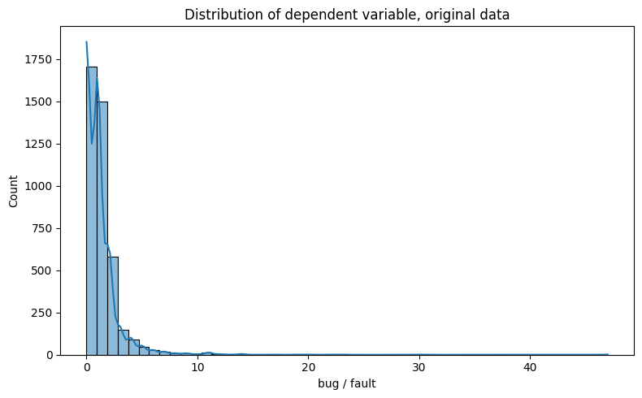
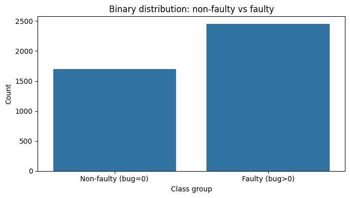
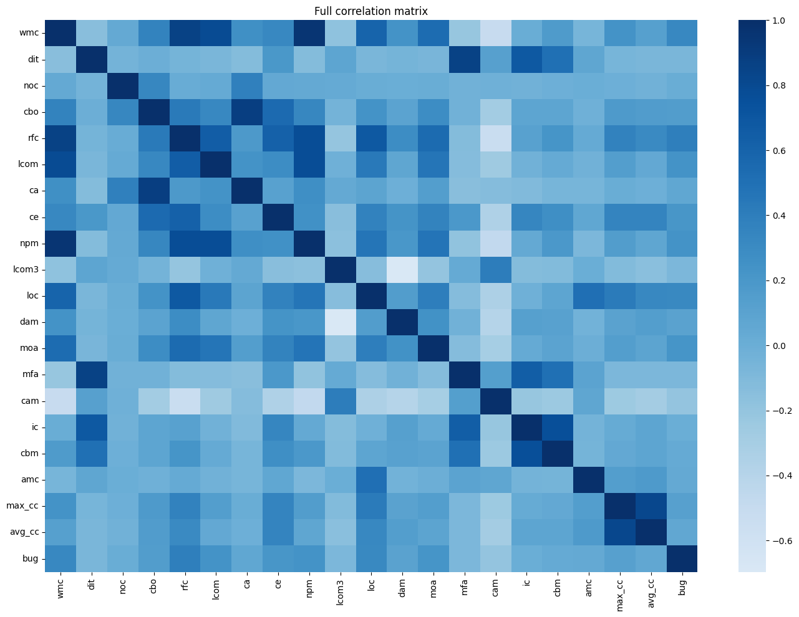
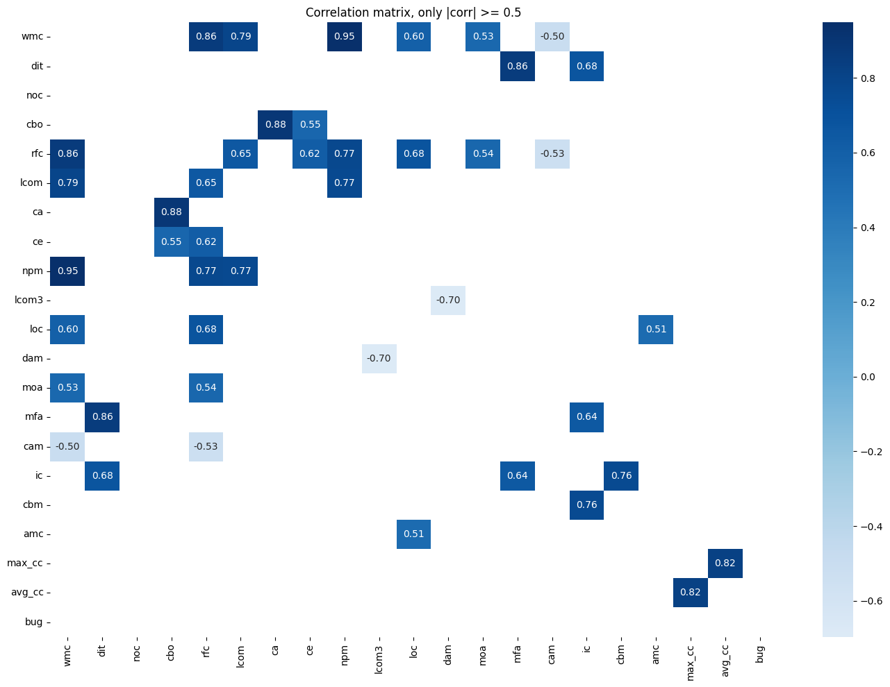
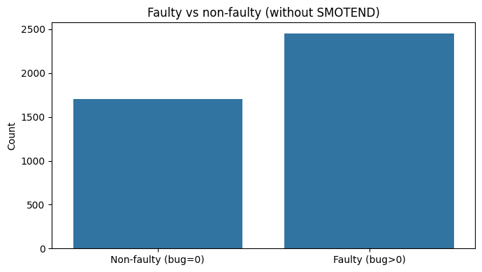
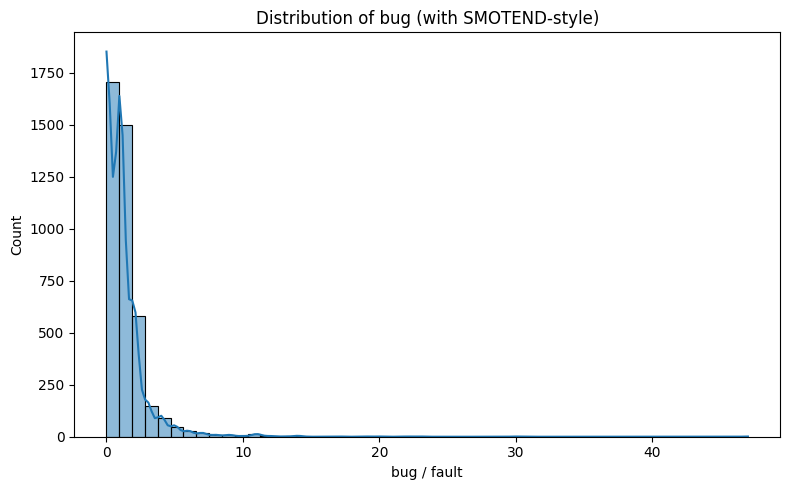
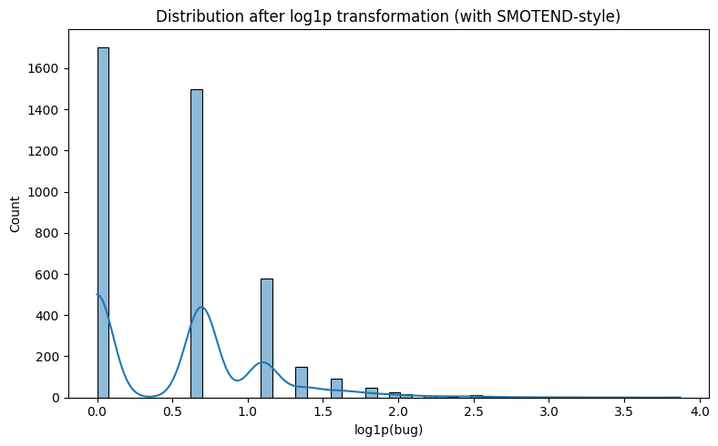

# Case Study: Dự đoán số lượng lỗi phần mềm bằng Deep Learning


**Project sử dụng:**  3 project trong PROMISE `bug-data`:

- `lucene`
- `poi`
- `xalan`


## 1. Import thư viện


```python
# ==============================================================================
# CELL 2: IMPORT THƯ VIỆN & CẤU HÌNH HỆ THỐNG
# ==============================================================================
from pathlib import Path     # Thư viện làm việc với đường dẫn file hệ thống (tương thích đa nền tảng)
import re                    # Thư viện xử lý Biểu thức chính quy (Regular Expressions) để tìm phiên bản từ tên file
import random                # Thư viện tạo số ngẫu nhiên mặc định của Python
import warnings              # Thư viện quản lý cảnh báo hệ thống
import platform              # Thư viện xem thông tin hệ điều hành và phiên bản Python
import json                  # Thư viện làm việc với định dạng dữ liệu JSON

import numpy as np           # Thư viện tính toán số học nâng cao và xử lý ma trận/mảng nhiều chiều
import pandas as pd          # Thư viện phân tích, biến đổi dữ liệu dạng bảng (DataFrames) cực kỳ mạnh mẽ
import matplotlib.pyplot as plt # Thư viện vẽ biểu đồ và trực quan hóa dữ liệu cơ bản
import seaborn as sns        # Thư viện vẽ biểu đồ thống kê đẹp mắt dựa trên Matplotlib

# Các công cụ hỗ trợ chia tập, chuẩn hóa và các thuật toán học máy từ Scikit-Learn
from sklearn.model_selection import train_test_split  # Chia bộ dữ liệu thành tập huấn luyện (Train) và tập kiểm thử (Test)
from sklearn.preprocessing import StandardScaler       # Chuẩn hóa đặc trưng về phân bố chuẩn (Z-score: Mean=0, Std=1)
from sklearn.metrics import mean_squared_error        # Tính sai số bình phương trung bình (MSE) cho bài toán hồi quy
from sklearn.neighbors import NearestNeighbors         # Thuật toán tìm kiếm láng giềng gần nhất (dùng trong thuật toán SMOTEND)
from sklearn.tree import DecisionTreeRegressor         # Mô hình cây quyết định phục vụ bài toán hồi quy (mô hình đối chứng)
from sklearn.svm import SVR                            # Mô hình Vector hỗ trợ cho bài toán hồi quy (mô hình đối chứng)

from scipy.stats import kendalltau                     # Tính hệ số tương quan thứ bậc Kendall (Kendall's Tau) để đánh giá thứ hạng lỗi

# Các module của TensorFlow / Keras để xây dựng mạng Neural học sâu
import tensorflow as tf
from tensorflow.keras import Input, Model              # Định nghĩa đầu vào và cấu trúc mô hình theo Functional API
from tensorflow.keras.layers import Dense, Dropout, Flatten, Concatenate, Conv1D, MaxPooling1D # Các tầng mạng Neural chuyên biệt
from tensorflow.keras.optimizers import Adam           # Bộ tối ưu hóa Adam cập nhật trọng số mạng nơ-ron hiệu quả
from tensorflow.keras.callbacks import EarlyStopping, ReduceLROnPlateau # Cơ chế dừng sớm và giảm tốc độ học tự động

# Tắt các cảnh báo hệ thống không quan trọng giúp đầu ra của notebook gọn gàng hơn
warnings.filterwarnings("ignore")

# Thiết lập Random Seed đồng bộ để đảm bảo tính lặp lại (Reproducibility) của các thử nghiệm
RANDOM_STATE = 42
np.random.seed(RANDOM_STATE)
random.seed(RANDOM_STATE)
tf.random.set_seed(RANDOM_STATE)

# Cấu hình giao diện hiển thị bảng dữ liệu của Pandas để xem được nhiều cột
pd.set_option("display.max_columns", 100)
pd.set_option("display.width", 160)

# In ra các thông số phiên bản hệ thống đang chạy
print("Python:", platform.python_version())
print("TensorFlow:", tf.__version__)
print("Pandas:", pd.__version__)
print("NumPy:", np.__version__)
```

**Output:**
```text
Python: 3.13.12
TensorFlow: 2.21.0
Pandas: 3.0.3
NumPy: 2.4.6
```

## 2. Khai báo dataset


```python
# ==============================================================================
# CELL 4: KHAI BÁO CẤU HÌNH DATASET & THƯ MỤC LƯU KẾT QUẢ
# ==============================================================================
# Đường dẫn gốc tới thư mục chứa dữ liệu lỗi PROMISE
BASE_PATH = Path("PROMISE-BACKUP/bug-data")

# Danh sách 3 dự án mã nguồn mở được phân tích
PROJECTS = ["lucene", "poi", "xalan"]

# Bộ lọc các phiên bản cụ thể cho từng dự án để khớp với cấu hình bài báo nghiên cứu gốc
PAPER_VERSION_FILTER = {
    "lucene": {"2.0", "2.2", "2.4"},
    "poi": {"1.5", "2.0", "2.5", "3.0"},
    "xalan": {"2.4", "2.5", "2.6", "2.7"},
}

# Kích hoạt bộ lọc phiên bản theo bài báo khoa học (đặt thành False nếu muốn đọc tất cả phiên bản)
USE_PAPER_VERSION_FILTER = True

# Danh sách 20 thuộc tính chất lượng phần mềm hướng đối tượng (CK metrics & OO metrics) làm biến độc lập (X)
FEATURES = [
    "wmc", "dit", "noc", "cbo",     # wmc: độ phức tạp class; dit: độ sâu kế thừa; noc: số class con; cbo: độ phụ thuộc
    "rfc", "lcom", "ca", "ce",      # rfc: số phương thức có thể phản hồi; lcom: độ thiếu gắn kết; ca/ce: coupling đầu vào/ra
    "npm", "lcom3", "loc", "dam",   # npm: số public methods; lcom3: lcom cải tiến; loc: số dòng code; dam: độ đóng gói
    "moa", "mfa", "cam", "ic",      # moa: độ kết hợp thuộc tính; mfa: tỷ lệ hàm kế thừa; cam: độ gắn kết tham số; ic: coupling kế thừa
    "cbm", "amc", "max_cc", "avg_cc" # cbm: coupling phương thức; amc: kích thước phương thức TB; max/avg_cc: độ phức tạp McCabe
]

# Tên cột biến mục tiêu (Target) chứa số lượng lỗi được tìm thấy trong lớp đó
TARGET = "bug"

# Tạo thư mục đầu ra để lưu các bảng kết quả và biểu đồ phân tích
OUTPUT_DIR = Path("outputs_promise_fault_prediction_9_5")
OUTPUT_DIR.mkdir(exist_ok=True)

# In thông tin cấu hình ra màn hình
print("Base path:", BASE_PATH.resolve())
print("Projects:", PROJECTS)
print("Use paper version filter:", USE_PAPER_VERSION_FILTER)
print("Output dir:", OUTPUT_DIR.resolve())
```

**Output:**
```text
Base path: /Users/tuna/Hoc/HOC-MAY_N/PROMISE-BACKUP/bug-data
Projects: ['lucene', 'poi', 'xalan']
Use paper version filter: True
Output dir: /Users/tuna/Hoc/HOC-MAY_N/outputs_promise_fault_prediction_9_5
```

## 3. Đọc và gộp dữ liệu từ PROMISE bug-data


```python
# ==============================================================================
# CELL 6: ĐỌC, LỌC VÀ GỘP DỮ LIỆU TỪ CÁC FILE CSV CỦA DỰ ÁN PROMISE
# ==============================================================================
def extract_version_from_filename(file_path: Path, project: str) -> str:
    """
    Hàm trích xuất số phiên bản từ tên file CSV của dự án.
    Ví dụ: 'lucene-2.0.csv' của dự án 'lucene' sẽ trả về '2.0'.
    """
    stem = file_path.stem.lower() # Lấy tên file không kèm đuôi mở rộng và đưa về chữ thường
    prefix = project.lower() + "-"
    if stem.startswith(prefix):
        return stem.replace(prefix, "", 1) # Xóa phần tiền tố tên dự án
    match = re.search(r"(\d+(?:\.\d+)*)", stem) # Tìm chuỗi số phiên bản bằng Regex (ví dụ: 1.5, 2.6.1)
    return match.group(1) if match else stem


def load_selected_projects(
    base_path: Path,
    projects: list[str],
    version_filter: dict[str, set[str]] | None = None,
) -> tuple[pd.DataFrame, pd.DataFrame]:
    """
    Hàm duyệt qua các thư mục dự án, đọc các file CSV, lọc phiên bản và gộp chúng lại.
    """
    all_frames = []      # Danh sách chứa DataFrame của từng file CSV
    file_summary = []    # Danh sách chứa thông tin tóm tắt từng file (để in báo cáo)

    # Kiểm tra xem đường dẫn thư mục gốc có tồn tại không
    if not base_path.exists():
        raise FileNotFoundError(
            f"Không tìm thấy thư mục: {base_path.resolve()}\n"
            "Hãy sửa BASE_PATH, ví dụ: Path('/content/PROMISE-backup/bug-data')"
        )

    # Duyệt qua từng dự án trong danh sách
    for project in projects:
        folder = base_path / project
        if not folder.exists():
            raise FileNotFoundError(f"Không tìm thấy folder project: {folder.resolve()}")

        # Lấy tất cả các file CSV của dự án hiện tại và sắp xếp theo thứ tự
        csv_files = sorted(folder.glob("*.csv"))
        if not csv_files:
            raise FileNotFoundError(f"Không tìm thấy CSV trong: {folder.resolve()}")

        for file_path in csv_files:
            # Tách phiên bản từ tên file
            version = extract_version_from_filename(file_path, project)

            # Lọc phiên bản theo cấu hình bài báo (nếu được kích hoạt)
            if version_filter is not None:
                allowed_versions = version_filter.get(project, set())
                if version not in allowed_versions:
                    continue # Bỏ qua các phiên bản không nằm trong bộ lọc

            # Đọc file CSV
            df = pd.read_csv(file_path)
            # Chuẩn hóa tên cột bằng cách xóa khoảng trắng thừa ở hai đầu và đưa về chữ thường
            df.columns = [str(c).strip().lower() for c in df.columns]

            # Thêm cột định danh nguồn gốc của dòng dữ liệu
            df["project"] = project
            df["version"] = version
            df["source_file"] = file_path.name

            all_frames.append(df)
            file_summary.append({
                "project": project,
                "version": version,
                "file": file_path.name,
                "rows": len(df),
                "columns": len(df.columns),
            })

    # Nếu không đọc được file nào thì báo lỗi
    if not all_frames:
        raise ValueError(
            "Không đọc được file nào. Kiểm tra lại BASE_PATH hoặc đặt USE_PAPER_VERSION_FILTER = False."
        )

    # Gộp tất cả các DataFrame nhỏ thành một DataFrame tổng duy nhất
    raw_df = pd.concat(all_frames, ignore_index=True)
    # Tạo bảng tóm tắt chi tiết các file đã đọc
    summary_df = pd.DataFrame(file_summary).sort_values(["project", "version"]).reset_index(drop=True)
    return raw_df, summary_df


# Thực hiện gọi hàm đọc dữ liệu
version_filter = PAPER_VERSION_FILTER if USE_PAPER_VERSION_FILTER else None
raw_df, file_summary = load_selected_projects(BASE_PATH, PROJECTS, version_filter=version_filter)

# Hiển thị kết quả tóm tắt quá trình đọc dữ liệu
print("Số file đã đọc:", len(file_summary))
display(file_summary)
print("Kích thước dữ liệu sau khi gộp:", raw_df.shape)
display(raw_df.head())
```

**Output:**
```text
Số file đã đọc: 11
   project version            file  rows  columns
0   lucene     2.0  lucene-2.0.csv   195       25
1   lucene     2.2  lucene-2.2.csv   247       25
2   lucene     2.4  lucene-2.4.csv   340       25
3      poi     1.5     poi-1.5.csv   237       25
4      poi     2.0     poi-2.0.csv   314       25
5      poi     2.5     poi-2.5.csv   385       25
6      poi     3.0     poi-3.0.csv   442       25
7    xalan     2.4   xalan-2.4.csv   723       25
8    xalan     2.5   xalan-2.5.csv   803       25
9    xalan     2.6   xalan-2.6.csv   885       25
10   xalan     2.7   xalan-2.7.csv   909       25Kích thước dữ liệu sau khi gộp: (5480, 25)
                                            name  wmc  dit  noc  cbo  rfc  lcom  ca  ce  npm     lcom3   loc  dam  moa       mfa       cam  ic  cbm  \
0  org.apache.lucene.analysis.WhitespaceAnalyzer    2    2    0    3    4     1   0   3    2  2.000000    10  0.0    0  0.666667  0.666667   0    0   
1       org.apache.lucene.search.QueryTermVector   10    1    0    4   37     0   0   4    9  0.388889   278  1.0    0  0.000000  0.340000   0    0   
2       org.apache.lucene.analysis.PorterStemmer   27    1    0    1   43    13   1   0   13  0.600962  1174  1.0    0  0.000000  0.253086   0    0   
3          org.apache.lucene.index.TermPositions    1    1    0   21    1     0  20   1    1  2.000000     1  0.0    0  0.000000  1.000000   0    0   
4         org.apache.lucene.analysis.TokenStream    3    1    2   19    4     3  18   1    3  2.000000     7  0.0    0  0.000000  1.000000   0    0   

         amc  max_cc  avg_cc  bug project version     source_file  
0   4.000000       1  0.5000    0  lucene     2.0  lucene-2.0.csv  
1  26.600000       5  1.6000    0  lucene     2.0  lucene-2.0.csv  
2  42.185185      26  5.7407    0  lucene     2.0  lucene-2.0.csv  
3   0.000000       1  1.0000    3  lucene     2.0  lucene-2.0.csv  
4   1.333333       1  0.6667    1  lucene     2.0  lucene-2.0.csv  
```

## 4. Làm sạch dữ liệu


```python
# ==============================================================================
# CELL 8: TIỀN XỬ LÝ LÀM SẠCH DỮ LIỆU & LOẠI BỎ TRÙNG LẶP (ANTI DATA LEAKAGE)
# ==============================================================================
# Kiểm tra xem dữ liệu thô có chứa đủ 20 đặc trưng và target 'bug' không
required_columns = FEATURES + [TARGET]
missing_columns = [col for col in required_columns if col not in raw_df.columns]
if missing_columns:
    raise ValueError("Thiếu các cột bắt buộc: " + str(missing_columns))


def basic_cleaning(df: pd.DataFrame) -> pd.DataFrame:
    """
    Hàm làm sạch dữ liệu: Chỉ giữ lại các cột cần thiết, ép kiểu dữ liệu số,
    loại bỏ các giá trị thiếu (NaN) và các dòng dữ liệu trùng lặp.
    """
    cleaned = df.copy()

    # Chỉ giữ lại các cột định danh thiết yếu cùng với 20 đặc trưng và cột target
    id_cols = [col for col in ["project", "version", "source_file", "name"] if col in cleaned.columns]
    cleaned = cleaned[id_cols + FEATURES + [TARGET]].copy()

    # Ép các cột đặc trưng và cột target về kiểu số.
    # errors="coerce" sẽ biến các giá trị không hợp lệ (như chuỗi lỗi) thành NaN thay vì gây crash.
    for col in FEATURES + [TARGET]:
        cleaned[col] = pd.to_numeric(cleaned[col], errors="coerce")

    n_before = len(cleaned)
    # Đếm số dòng chứa ít nhất một giá trị thiếu (NaN) trong các cột đặc trưng hoặc target
    n_missing = int(cleaned[FEATURES + [TARGET]].isna().any(axis=1).sum())

    # Loại bỏ toàn bộ các dòng chứa NaN trong các cột đặc trưng hoặc target
    cleaned = cleaned.dropna(subset=FEATURES + [TARGET]).copy()

    # Đếm số dòng trùng lặp dựa trên tổ hợp đặc trưng và giá trị lỗi.
    # Việc xóa trùng lặp (deduplication) cực kỳ quan trọng để chống Data Leakage (Rò rỉ dữ liệu).
    # Nhiều class không đổi mã nguồn giữa các phiên bản sẽ sinh ra các dòng giống hệt nhau. 
    # Nếu không xóa trùng, chúng có thể nằm ở cả tập Train và tập Test gây overfitting ảo.
    n_duplicate_model_cols = int(cleaned.duplicated(subset=FEATURES + [TARGET]).sum())
    cleaned = cleaned.drop_duplicates(subset=FEATURES + [TARGET]).reset_index(drop=True)

    # In kết quả thống kê quá trình làm sạch dữ liệu
    print("Kích thước trước xử lý:", df.shape)
    print("Số dòng thiếu dữ liệu:", n_missing)
    print("Số dòng trùng theo FEATURES + bug:", n_duplicate_model_cols)
    print("Kích thước sau xử lý:", cleaned.shape)
    print("Số dòng bị loại:", n_before - len(cleaned))

    return cleaned


# Gọi hàm thực hiện làm sạch dữ liệu
clean_df = basic_cleaning(raw_df)
display(clean_df.head())
```

**Output:**
```text
Kích thước trước xử lý: (5480, 25)
Số dòng thiếu dữ liệu: 0
Số dòng trùng theo FEATURES + bug: 1323
Kích thước sau xử lý: (4157, 25)
Số dòng bị loại: 1323
  project version     source_file                                           name  wmc  dit  noc  cbo  rfc  lcom  ca  ce  npm     lcom3   loc  dam  moa  \
0  lucene     2.0  lucene-2.0.csv  org.apache.lucene.analysis.WhitespaceAnalyzer    2    2    0    3    4     1   0   3    2  2.000000    10  0.0    0   
1  lucene     2.0  lucene-2.0.csv       org.apache.lucene.search.QueryTermVector   10    1    0    4   37     0   0   4    9  0.388889   278  1.0    0   
2  lucene     2.0  lucene-2.0.csv       org.apache.lucene.analysis.PorterStemmer   27    1    0    1   43    13   1   0   13  0.600962  1174  1.0    0   
3  lucene     2.0  lucene-2.0.csv          org.apache.lucene.index.TermPositions    1    1    0   21    1     0  20   1    1  2.000000     1  0.0    0   
4  lucene     2.0  lucene-2.0.csv         org.apache.lucene.analysis.TokenStream    3    1    2   19    4     3  18   1    3  2.000000     7  0.0    0   

        mfa       cam  ic  cbm        amc  max_cc  avg_cc  bug  
0  0.666667  0.666667   0    0   4.000000       1  0.5000    0  
1  0.000000  0.340000   0    0  26.600000       5  1.6000    0  
2  0.000000  0.253086   0    0  42.185185      26  5.7407    0  
3  0.000000  1.000000   0    0   0.000000       1  1.0000    3  
4  0.000000  1.000000   0    0   1.333333       1  0.6667    1  
```

## 5. Thống kê dataset và phân bố biến mục tiêu

```python
# ==============================================================================
# CELL 10: THỐNG KÊ MÔ TẢ DATASET & PHÂN TÍCH PHÂN BỐ BIẾN MỤC TIÊU 'BUG'
# ==============================================================================
print("Thống kê số dòng theo project/version:")
# Tạo bảng thống kê mô tả chi tiết của từng phiên bản dự án
dataset_table = clean_df.groupby(["project", "version"]).agg(
    rows=(TARGET, "size"),                                     # Tổng số class (dòng dữ liệu)
    faulty_classes=(TARGET, lambda s: int((s > 0).sum())),     # Số lượng class bị lỗi (bug > 0)
    non_faulty_classes=(TARGET, lambda s: int((s == 0).sum())), # Số lượng class lành lặn (bug == 0)
    max_bug=(TARGET, "max"),                                   # Số lượng lỗi lớn nhất trong một class
    mean_bug=(TARGET, "mean"),                                 # Số lượng lỗi trung bình trên một class
).reset_index()

# Tính tỷ lệ phần trăm class bị lỗi trên tổng số class của phiên bản đó
dataset_table["faulty_rate_%"] = (dataset_table["faulty_classes"] / dataset_table["rows"] * 100).round(2)
display(dataset_table)

print("Thống kê mô tả toán học của biến mục tiêu bug:")
display(clean_df[TARGET].describe())

# Đếm tổng số class bị lỗi và không bị lỗi trên toàn bộ tập dữ liệu gộp
faulty_count = int((clean_df[TARGET] > 0).sum())
non_faulty_count = int((clean_df[TARGET] == 0).sum())
print("Số class không lỗi bug = 0:", non_faulty_count)
print("Số class có lỗi bug > 0:", faulty_count)
print("Tỷ lệ class có lỗi:", round(faulty_count / len(clean_df) * 100, 2), "%")

# Thống kê chi tiết số lượng class tương ứng với từng giá trị số lỗi cụ thể (0, 1, 2, ... lỗi)
bug_count_table = clean_df[TARGET].value_counts().sort_index().rename_axis("bug").reset_index(name="count")
bug_count_table["percent"] = (bug_count_table["count"] / len(clean_df) * 100).round(2)
print("Phân bố chi tiết các giá trị bug:")
display(bug_count_table.head(30))

# Lưu các bảng thống kê kết quả thô xuống thư mục đầu ra dưới dạng CSV
dataset_table.to_csv(OUTPUT_DIR / "table_dataset_summary.csv", index=False)
bug_count_table.to_csv(OUTPUT_DIR / "table_bug_distribution.csv", index=False)
```

**Output:**
```text
Thống kê số dòng theo project/version:
   project version  rows  faulty_classes  non_faulty_classes  max_bug  mean_bug  faulty_rate_%
0   lucene     2.0   193              91                 102       22  1.388601          47.15
1   lucene     2.2   209             141                  68       47  1.966507          67.46
2   lucene     2.4   312             196                 116       30  2.000000          62.82
3      poi     1.5   219             130                  89       20  1.484018          59.36
4      poi     2.0   218              35                 183        2  0.169725          16.06
5      poi     2.5   269             213                  56       11  1.643123          79.18
6      poi     3.0   341             250                  91       19  1.375367          73.31
7    xalan     2.4   688             110                 578        7  0.226744          15.99
8    xalan     2.5   614             364                 250        9  0.827362          59.28
9    xalan     2.6   437             268                 169        9  1.068650          61.33
10   xalan     2.7   657             656                   1        8  1.328767          99.85Thống kê mô tả toán học của biến mục tiêu bug:
count    4157.000000
mean        1.101756
std         1.853252
min         0.000000
25%         0.000000
50%         1.000000
75%         1.000000
max        47.000000
Name: bug, dtype: float64Số class không lỗi bug = 0: 1703
Số class có lỗi bug > 0: 2454
Tỷ lệ class có lỗi: 59.03 %
Phân bố chi tiết các giá trị bug:
    bug  count  percent
0     0   1703    40.97
1     1   1497    36.01
2     2    579    13.93
3     3    148     3.56
4     4     91     2.19
5     5     49     1.18
6     6     26     0.63
7     7     17     0.41
8     8      8     0.19
9     9      8     0.19
10   10      3     0.07
11   11     12     0.29
12   12      3     0.07
13   13      1     0.02
14   14      4     0.10
15   16      1     0.02
16   17      1     0.02
17   19      1     0.02
18   20      1     0.02
19   22      1     0.02
20   23      1     0.02
21   30      1     0.02
22   47      1     0.02
```

```python
# ==============================================================================
# CELL 11: TRỰC QUAN HÓA PHÂN BỐ CỦA BIẾN MỤC TIÊU 'BUG' (BIẾN PHỤ THUỘC)
# ==============================================================================
# Biểu đồ 1: Phân bố số lượng lỗi (Histogram & Đường mật độ KDE)
# Biểu đồ chỉ ra rằng số lượng lỗi có phân bố lệch phải rất mạnh (right-skewed):
# Đa số class có 0 hoặc rất ít lỗi, trong khi một số ít class đặc biệt có số lỗi cực lớn (outliers) nằm ở đuôi phải.
plt.figure(figsize=(8, 5))
sns.histplot(clean_df[TARGET], bins=50, kde=True)
plt.title("Distribution of dependent variable, original data")
plt.xlabel("bug / fault")
plt.ylabel("Count")
plt.tight_layout()
plt.savefig(OUTPUT_DIR / "fig_distribution_original_bug.png", dpi=200) # Lưu biểu đồ độ phân giải cao
plt.show()

# Biểu đồ 2: Đếm số lượng lớp nhị phân (Class Lành lặn vs Class Bị lỗi)
# Giúp hình dung trực quan phân bố nhị phân của dữ liệu. Tỷ lệ ở mức nhị phân xấp xỉ 53% - 47%.
plt.figure(figsize=(7, 4))
sns.countplot(x=(clean_df[TARGET] > 0).map({False: "Non-faulty (bug=0)", True: "Faulty (bug>0)"}))
plt.title("Binary distribution: non-faulty vs faulty")
plt.xlabel("Class group")
plt.ylabel("Count")
plt.tight_layout()
plt.savefig(OUTPUT_DIR / "fig_binary_fault_distribution.png", dpi=200)
plt.show()
```





## 6. Ma trận tương quan


```python
# ==============================================================================
# CELL 13: PHÂN TÍCH MA TRẬN TƯƠNG QUAN GIỮA CÁC ĐẶC TRƯNG PHẦN MỀM (FEATURES)
# ==============================================================================
# Tính toán ma trận hệ số tương quan Pearson giữa 20 đặc trưng và biến mục tiêu
corr = clean_df[FEATURES + [TARGET]].corr()

# Biểu đồ 1: Heatmap thể hiện toàn bộ ma trận tương quan giữa tất cả các biến độc lập và phụ thuộc
plt.figure(figsize=(14, 10))
sns.heatmap(corr, cmap="Blues", center=0, annot=False) # Không hiện số để tránh bị rối mắt do quá nhiều ô
plt.title("Full correlation matrix")
plt.tight_layout()
plt.savefig(OUTPUT_DIR / "fig_full_correlation_matrix.png", dpi=200)
plt.show()

# Biểu đồ 2: Heatmap chỉ hiển thị các mối quan hệ tương quan mạnh (|hệ số| >= 0.5) và ghi rõ giá trị
# Nhiều chỉ số đo chất lượng code CK metrics có tương quan tuyến tính rất cao với nhau (Đa cộng tuyến - Multicollinearity).
# Ví dụ: Số dòng code 'loc' thường đồng biến mạnh với độ phức tạp class 'wmc' và tập phương thức phản hồi 'rfc'.
threshold = 0.5
strong_corr = corr.where((corr.abs() >= threshold) & (corr.abs() < 1.0))

plt.figure(figsize=(14, 10))
sns.heatmap(strong_corr, cmap="Blues", center=0, annot=True, fmt=".2f")
plt.title(f"Correlation matrix, only |corr| >= {threshold}")
plt.tight_layout()
plt.savefig(OUTPUT_DIR / "fig_strong_correlation_matrix.png", dpi=200)
plt.show()

# Thống kê xếp hạng độ tương quan tuyến tính trực tiếp giữa các đặc trưng đầu vào với biến mục tiêu bug
bug_corr = corr[TARGET].drop(TARGET).sort_values(key=lambda s: s.abs(), ascending=False)
bug_corr_df = bug_corr.to_frame("corr_with_bug")
print("Top feature tương quan với bug theo trị tuyệt đối:")
display(bug_corr_df)

# Lưu bảng tương quan này ra CSV
bug_corr_df.to_csv(OUTPUT_DIR / "table_correlation_with_bug.csv")
```





**Output:**
```text
Top feature tương quan với bug theo trị tuyệt đối:
        corr_with_bug
rfc          0.392349
wmc          0.322459
loc          0.311555
lcom         0.240461
npm          0.238061
moa          0.223757
ce           0.213649
cam         -0.197456
cbo          0.156548
max_cc       0.122607
dam          0.103022
mfa         -0.083376
lcom3       -0.081841
ca           0.070597
dit         -0.069183
avg_cc       0.057364
amc          0.041025
cbm          0.034195
noc          0.010227
ic           0.000076
```

## 9. SMOTEND-style oversampling

Bài báo dùng SMOTEND để xử lý mất cân bằng dữ liệu. Trong notebook này, ta cài trực tiếp phiên bản **SMOTEND-style** theo ý tưởng:

- Majority: class không lỗi, `bug = 0`
- Minority: class có lỗi, `bug > 0`
- Sinh thêm dữ liệu synthetic từ các mẫu faulty gần nhau
- Target synthetic là trung bình có trọng số theo khoảng cách giữa 2 mẫu
Tham số mặc định:

- `k = 5`
- `m = 6`, nghĩa là sinh đủ để cân bằng với majority nếu minority đang ít hơn
- `r = 2`, Minkowski distance tương đương Euclidean distance

```python
# ==============================================================================
# CELL 15: THUẬT TOÁN SMOTEND-STYLE OVERSAMPLING TỰ ĐỊNH NGHĨA CHO HỒI QUY
# ==============================================================================
def minkowski_distance(a: np.ndarray, b: np.ndarray, r: float = 2.0) -> float:
    """
    Tính khoảng cách hình học Minkowski giữa hai điểm đặc trưng a và b.
    r = 2.0 tương ứng với khoảng cách Euclidean (hình học phẳng chuẩn).
    r = 1.0 tương ứng với khoảng cách Manhattan.
    """
    return float(np.sum(np.abs(a - b) ** r) ** (1.0 / r))


def smotend_oversample(
    X: pd.DataFrame,
    y_bug: pd.Series,
    random_state: int = 42,
    k_neighbors: int = 5,
    m: int = 6,
    r: float = 2.0,
    n_parts: int = 6,
) -> tuple[pd.DataFrame, pd.Series, dict]:
    """
    Thuật toán sinh mẫu ảo SMOTEND cho bài toán hồi quy số lượng lỗi phần mềm.
    
    Cơ chế hoạt động:
      - Định nghĩa nhóm thiểu số D_min là các class có lỗi (bug > 0).
      - Định nghĩa nhóm đa số D_maj là các class lành lặn (bug == 0).
      - Số lượng mẫu ảo cần sinh: numSynthetic = (|D_maj| - |D_min|) * m / n_parts.
      - Với mỗi mẫu lỗi, tìm k láng giềng gần nhất thuộc nhóm có lỗi D_min bằng khoảng cách Minkowski.
      - Chọn ngẫu nhiên 1 láng giềng và sinh đặc trưng mới bằng phương pháp nội suy tuyến tính:
          new_X = v1 + random(0,1) * (v2 - v1)
      - Tính toán nhãn số lỗi mới cho new_X dựa trên tỷ lệ nghịch khoảng cách đến 2 mẫu gốc:
          y(new) = (d1 * y(v2) + d2 * y(v1)) / (d1 + d2)
    """
    # Khởi tạo bộ sinh số ngẫu nhiên đảm bảo tính lặp lại
    rng = np.random.default_rng(random_state)

    X_values = X.astype(float).to_numpy()
    y_values = y_bug.astype(float).to_numpy()

    # Tạo mặt nạ nhị phân phân tách class thiểu số (có lỗi) và đa số (không lỗi)
    minority_mask = y_values > 0
    majority_mask = y_values == 0

    X_min = X_values[minority_mask]
    y_min = y_values[minority_mask]
    n_min = len(X_min)
    n_maj = int(majority_mask.sum())

    # Khởi tạo cấu trúc dictionary lưu tóm tắt quá trình thực thi thuật toán
    summary = {
        "majority_non_faulty": n_maj,
        "minority_faulty": n_min,
        "k_neighbors": k_neighbors,
        "m": m,
        "r": r,
        "n_parts": n_parts,
        "synthetic_generated": 0,
        "note": "",
    }

    # Trường hợp đặc biệt 1: Không có mẫu lỗi nào để học láng giềng sinh mẫu
    if n_min == 0:
        summary["note"] = "Không có faulty class, không thể SMOTEND."
        return X.copy(), y_bug.copy(), summary

    # Trường hợp đặc biệt 2: Số mẫu thiểu số vốn đã lớn hơn số mẫu đa số, không cần sinh thêm
    if n_min >= n_maj:
        summary["note"] = (
            "Faulty không ít hơn non-faulty trong subset này, "
            "SMOTEND theo định nghĩa paper không sinh thêm mẫu."
        )
        return X.copy(), y_bug.copy(), summary

    # Tính toán số lượng mẫu ảo cần sinh theo công thức của bài báo khoa học
    num_synthetic = int(round((n_maj - n_min) * m / n_parts))
    summary["synthetic_generated"] = num_synthetic

    if num_synthetic <= 0:
        summary["note"] = "num_synthetic <= 0, không sinh thêm mẫu."
        return X.copy(), y_bug.copy(), summary

    # Đảm bảo số lượng láng giềng k không vượt quá số lượng mẫu có lỗi thực tế
    effective_k = min(k_neighbors + 1, n_min)
    
    # Khởi tạo thuật toán KNN với độ đo khoảng cách Minkowski
    nn = NearestNeighbors(n_neighbors=effective_k, metric="minkowski", p=r)
    nn.fit(X_min)
    neighbor_indices = nn.kneighbors(X_min, return_distance=False)

    # Loại bỏ chính nó (luôn nằm ở vị trí cột đầu tiên trong kết quả tìm kiếm KNN)
    if effective_k > 1:
        neighbor_indices = neighbor_indices[:, 1:]
    else:
        neighbor_indices = neighbor_indices[:, :1]

    synthetic_X = []
    synthetic_y = []

    index = 0
    # Vòng lặp sinh mẫu ảo cho đến khi đạt đủ số lượng mẫu cần thiết
    while len(synthetic_X) < num_synthetic:
        # Lấy mẫu hiện tại
        v1 = X_min[index]
        y1 = y_min[index]

        # Lấy danh sách chỉ số các láng giềng gần nhất của nó
        neighbors = neighbor_indices[index]
        if len(neighbors) == 0:
            chosen_neighbor_idx = index
        else:
            chosen_neighbor_idx = int(rng.choice(neighbors)) # Chọn ngẫu nhiên 1 láng giềng

        # Lấy mẫu láng giềng được chọn
        v2 = X_min[chosen_neighbor_idx]
        y2 = y_min[chosen_neighbor_idx]

        # Thực hiện nội suy tuyến tính sinh mẫu đặc trưng mới new_x
        lam = float(rng.random()) # Hệ số ngẫu nhiên lambda trong khoảng [0, 1]
        new_x = v1 + lam * (v2 - v1)

        # Tính khoảng cách Minkowski từ new_x đến 2 mẫu gốc v1 và v2
        d1 = minkowski_distance(new_x, v1, r=r)
        d2 = minkowski_distance(new_x, v2, r=r)
        denom = d1 + d2

        # Nội suy nhãn số lỗi y tương ứng cho new_x dựa trên tỷ trọng khoảng cách
        if denom == 0:
            new_y = (y1 + y2) / 2.0
        else:
            new_y = (d1 * y2 + d2 * y1) / denom

        # Số lượng lỗi dự đoán sinh ra không được nhỏ hơn 0 (vì tối thiểu là 0 lỗi)
        new_y = max(0.0, float(new_y))

        synthetic_X.append(new_x)
        synthetic_y.append(new_y)

        # Xoay vòng qua các mẫu lỗi thực tế để đảm bảo tính phân tán đều
        index = (index + 1) % n_min

    # Tạo DataFrame Pandas từ các mẫu ảo được sinh ra
    X_syn = pd.DataFrame(synthetic_X, columns=X.columns)
    y_syn = pd.Series(synthetic_y, name=y_bug.name)

    # Nối dữ liệu gốc và dữ liệu nhân bản (mẫu ảo) lại với nhau
    X_balanced = pd.concat([X.reset_index(drop=True), X_syn], ignore_index=True)
    y_balanced = pd.concat([y_bug.reset_index(drop=True), y_syn], ignore_index=True)

    summary["note"] = "Đã sinh synthetic faulty samples bằng SMOTEND-style."
    return X_balanced, y_balanced, summary
```

## 10. Chuẩn bị dữ liệu cho 2 thí nghiệm

- **Experiment 1:** Không dùng SMOTEND.
- **Experiment 2:** Có dùng SMOTEND-style.

```python
# ==============================================================================
# CELL 17: PHÂN TÁCH TRAIN/TEST, CHUẨN HÓA & LOG-TRANSFORM BIẾN MỤC TIÊU CHI TIẾT
# ==============================================================================
def prepare_experiment_data(clean_df: pd.DataFrame, use_smotend: bool):
    """
    Hàm đóng gói toàn bộ quy trình chuẩn bị dữ liệu cho một Thử nghiệm:
      1. Tách X, y.
      2. Áp dụng SMOTEND cân bằng lớp (nếu được kích hoạt).
      3. Áp dụng Log-transformation cho target: y_log = log1p(y).
      4. Chia dữ liệu thành 70% Train / 30% Test độc lập.
      5. Áp dụng StandardScaler chuẩn hóa đầu vào Z-score độc lập cho Train và Test.
    """
    X_raw = clean_df[FEATURES].copy()
    y_bug_raw = clean_df[TARGET].astype(float).copy()

    smotend_summary = None

    # Bước 1: Cân bằng dữ liệu bằng SMOTEND (nếu use_smotend = True)
    if use_smotend:
        X_work, y_bug_work, smotend_summary = smotend_oversample(
            X_raw,
            y_bug_raw,
            random_state=RANDOM_STATE,
            k_neighbors=5,
            m=6,
            r=2.0,
            n_parts=6,
        )
    else:
        # Nếu không cân bằng, giữ nguyên dữ liệu gốc
        X_work = X_raw.copy().reset_index(drop=True)
        y_bug_work = y_bug_raw.copy().reset_index(drop=True)
        smotend_summary = {
            "majority_non_faulty": int((y_bug_work == 0).sum()),
            "minority_faulty": int((y_bug_work > 0).sum()),
            "synthetic_generated": 0,
            "note": "Experiment không dùng SMOTEND."
        }

    # Bước 2: Log-transformation biến mục tiêu y_log = ln(y + 1)
    # Rất quan trọng để ổn định phương sai và giảm độ lệch của dữ liệu phân bố lệch phải
    y_log = np.log1p(y_bug_work.astype(float).to_numpy())

    # Tạo nhãn phân tầng (stratify) nhị phân dựa trên class có lỗi hay không
    stratify_labels = (y_bug_work > 0).astype(int)
    # Kiểm tra xem có đủ điều kiện để phân tầng cân bằng hay không
    can_stratify = stratify_labels.nunique() == 2 and stratify_labels.value_counts().min() >= 2

    # Bước 3: Chia Train/Test theo tỷ lệ 70/30, phân tầng theo tình trạng lỗi
    X_train_raw, X_test_raw, y_train, y_test, y_bug_train, y_bug_test = train_test_split(
        X_work,
        y_log,
        y_bug_work.to_numpy(),
        test_size=0.30,
        random_state=RANDOM_STATE,
        shuffle=True,
        stratify=stratify_labels if can_stratify else None,
    )

    # Bước 4: Chuẩn hóa Z-score các đặc trưng độc lập để tránh rò rỉ dữ liệu (Data Leakage)
    scaler = StandardScaler()
    X_train = scaler.fit_transform(X_train_raw) # fit_transform CHỈ chạy trên tập Train
    X_test = scaler.transform(X_test_raw)       # Dùng tham số trung bình/độ lệch của Train để chuẩn hóa tập Test

    # Lưu trữ thông tin metadata của thí nghiệm
    data_info = {
        "X_work": X_work,
        "y_bug_work": y_bug_work,
        "y_log": y_log,
        "scaler": scaler,
        "smotend_summary": smotend_summary,
        "train_size": len(X_train),
        "test_size": len(X_test),
    }

    return X_train, X_test, y_train, y_test, y_bug_train, y_bug_test, data_info


# Tạo dữ liệu cho Thực nghiệm 1: Không sử dụng SMOTEND
X_train_no, X_test_no, y_train_no, y_test_no, y_bug_train_no, y_bug_test_no, info_no = prepare_experiment_data(clean_df, use_smotend=False)
# Tạo dữ liệu cho Thực nghiệm 2: Có sử dụng SMOTEND-style
X_train_sm, X_test_sm, y_train_sm, y_test_sm, y_bug_train_sm, y_bug_test_sm, info_sm = prepare_experiment_data(clean_df, use_smotend=True)

# In chi tiết kích thước dữ liệu huấn luyện và kết quả sinh mẫu của hai thực nghiệm
print("Experiment 1 - without SMOTEND")
print("Train:", X_train_no.shape, "Test:", X_test_no.shape)
print(info_no["smotend_summary"])

print("\nExperiment 2 - with SMOTEND-style")
print("Train:", X_train_sm.shape, "Test:", X_test_sm.shape)
print(info_sm["smotend_summary"])
```

**Output:**
```text
Experiment 1 - without SMOTEND
Train: (2909, 20) Test: (1248, 20)
{'majority_non_faulty': 1703, 'minority_faulty': 2454, 'synthetic_generated': 0, 'note': 'Experiment không dùng SMOTEND.'}

Experiment 2 - with SMOTEND-style
Train: (2909, 20) Test: (1248, 20)
{'majority_non_faulty': 1703, 'minority_faulty': 2454, 'k_neighbors': 5, 'm': 6, 'r': 2.0, 'n_parts': 6, 'synthetic_generated': 0, 'note': 'Faulty không ít hơn non-faulty trong subset này, SMOTEND theo định nghĩa paper không sinh thêm mẫu.'}
```

## 11. Phân bố sau SMOTEND và sau log transformation


```python
# ==============================================================================
# CELL 19: TRỰC QUAN HÓA SO SÁNH PHÂN BỐ SAU BIẾN ĐỔI LOG & SMOTEND CỦA 2 THÍ NGHIỆM
# ==============================================================================
def plot_target_distribution(y_bug, y_log, title_suffix, filename_prefix):
    """
    Hàm vẽ 3 biểu đồ chẩn đoán phân bố của biến mục tiêu:
      1. Phân bố số lượng lỗi thô.
      2. Phân bố số lượng lỗi sau khi biến đổi log1p.
      3. Biểu đồ đếm nhị phân lành lặn vs có lỗi.
    """
    fig_df = pd.DataFrame({
        "bug": np.asarray(y_bug),
        "log1p_bug": np.asarray(y_log),
        "fault_group": np.where(np.asarray(y_bug) > 0, "Faulty (bug>0)", "Non-faulty (bug=0)")
    })

    # Biểu đồ 1: Số lỗi thô
    plt.figure(figsize=(8, 5))
    sns.histplot(fig_df["bug"], bins=50, kde=True)
    plt.title(f"Distribution of bug {title_suffix}")
    plt.xlabel("bug / fault")
    plt.ylabel("Count")
    plt.tight_layout()
    plt.savefig(OUTPUT_DIR / f"{filename_prefix}_bug_distribution.png", dpi=200)
    plt.show()

    # Biểu đồ 2: Phân bố log-scale (bước biến đổi giúp phân bố gần dạng chuẩn hơn)
    plt.figure(figsize=(8, 5))
    sns.histplot(fig_df["log1p_bug"], bins=50, kde=True)
    plt.title(f"Distribution after log1p transformation {title_suffix}")
    plt.xlabel("log1p(bug)")
    plt.ylabel("Count")
    plt.tight_layout()
    plt.savefig(OUTPUT_DIR / f"{filename_prefix}_log_distribution.png", dpi=200)
    plt.show()

    # Biểu đồ 3: So sánh nhị phân
    plt.figure(figsize=(7, 4))
    sns.countplot(data=fig_df, x="fault_group")
    plt.title(f"Faulty vs non-faulty {title_suffix}")
    plt.xlabel("")
    plt.ylabel("Count")
    plt.tight_layout()
    plt.savefig(OUTPUT_DIR / f"{filename_prefix}_faulty_non_faulty.png", dpi=200)
    plt.show()


# Thực hiện vẽ các biểu đồ phân bố cho cả hai Thí nghiệm để so sánh
plot_target_distribution(info_no["y_bug_work"], info_no["y_log"], "(without SMOTEND)", "exp1_without_smotend")
plot_target_distribution(info_sm["y_bug_work"], info_sm["y_log"], "(with SMOTEND-style)", "exp2_with_smotend")
```









## 12. Chia 20 feature thành 5 nhóm theo kiến trúc bài báo

Bài báo chia 20 software metrics thành 5 nhóm, mỗi nhóm 4 feature:

1. `WMC, DIT, NOC, CBO`
2. `RFC, LCOM, CA, CE`
3. `NPM, LCOM3, LOC, DAM`
4. `MOA, MFA, CAM, IC`
5. `CBM, AMC, MAX_CC, AVG_CC`

```python
# ==============================================================================
# CELL 21: PHÂN NHÓM 20 ĐẶC TRƯNG CK METRICS THÀNH 5 NHÁNH ĐẦU VÀO ĐỘC LẬP
# ==============================================================================
# Theo kiến trúc đột phá của bài báo gốc, 20 CK metrics được chia thành 5 nhóm độc lập
# đại diện cho 5 khía cạnh chất lượng thiết kế của lớp phần mềm:
FEATURE_GROUPS = [
    ["wmc", "dit", "noc", "cbo"],     # Nhóm 1: Độ phức tạp tuần tự & Kiến trúc kế thừa
    ["rfc", "lcom", "ca", "ce"],      # Nhóm 2: Tập phương thức phản hồi & Độ thiếu gắn kết cục bộ
    ["npm", "lcom3", "loc", "dam"],   # Nhóm 3: Encapsulation (Độ đóng gói), Số dòng code, Số hàm public
    ["moa", "mfa", "cam", "ic"],      # Nhóm 4: Abstraction (Độ trừu tượng) & Tính tổng hợp
    ["cbm", "amc", "max_cc", "avg_cc"],# Nhóm 5: Độ phức tạp nâng cao & Liên kết giữa các phương thức nội bộ
]

# Ánh xạ từ tên thuộc tính sang chỉ số index tương ứng của nó trong mảng dữ liệu FEATURES
feature_to_index = {feature: idx for idx, feature in enumerate(FEATURES)}
# Chuyển đổi tên thuộc tính trong các nhóm thành mảng các chỉ số index phục vụ cắt mảng (slicing)
GROUP_INDICES = [[feature_to_index[f] for f in group] for group in FEATURE_GROUPS]

# In ra các nhóm thuộc tính
for i, group in enumerate(FEATURE_GROUPS, start=1):
    print(f"Group {i}:", group)


def split_groups_for_mlp(X_array: np.ndarray):
    """
    Hàm cắt mảng X đầu vào phẳng thành 5 nhánh riêng biệt phù hợp cho mạng MLP song song.
    Mỗi nhánh đầu ra có dạng ma trận 2D phẳng: (batch_size, 4).
    """
    return [X_array[:, idxs] for idxs in GROUP_INDICES]


def split_groups_for_cnn(X_array: np.ndarray):
    """
    Hàm cắt và định hình lại mảng X cho mạng tích chập 1 chiều (CNN 1D).
    CNN 1D yêu cầu đầu vào dạng Tensor 3D: (batch_size, steps/features, channels).
    Vì thế ta định hình lại (reshape) 4 thuộc tính mỗi nhóm thành dạng (batch_size, 4, 1) với 1 channel ảo.
    """
    return [X_array[:, idxs].reshape(-1, 4, 1) for idxs in GROUP_INDICES]
```

**Output:**
```text
Group 1: ['wmc', 'dit', 'noc', 'cbo']
Group 2: ['rfc', 'lcom', 'ca', 'ce']
Group 3: ['npm', 'lcom3', 'loc', 'dam']
Group 4: ['moa', 'mfa', 'cam', 'ic']
Group 5: ['cbm', 'amc', 'max_cc', 'avg_cc']
```

```python
# ==============================================================================
# CELL 22 (BỔ SUNG): ĐỊNH NGHĨA KIẾN TRÚC MẠNG NEURAL SONG SONG ĐA ĐẦU VÀO
# ==============================================================================
# Do file gốc sử dụng hàm build_cnn_model và build_mlp_model nhưng chưa định nghĩa trong các cell,
# chúng tôi tiến hành bổ sung định nghĩa hai kiến trúc mạng này theo đúng tài liệu thiết kế.

def build_cnn_model(learning_rate=0.001):
    """
    Xây dựng kiến trúc Parallel Multi-Input CNN 1D cho dữ liệu CK metrics.
    Mô hình có 5 nhánh tích chập song song xử lý độc lập 5 khía cạnh chất lượng mã nguồn:
      - Tích chập 1 chiều Conv1D giúp học mối quan hệ tương quan cục bộ giữa 4 metrics trong cùng nhóm.
      - MaxPooling1D giảm chiều trích xuất đặc trưng nổi bật nhất.
      - Dropout chống overfitting (quá khớp).
      - Flatten làm phẳng đặc trưng để ghép nối.
      - Concatenate kết hợp đặc trưng từ 5 nhánh thành một vector duy nhất.
      - Các tầng Dense chung phía sau học tương quan phi tuyến chéo và đưa ra dự báo linear hồi quy.
    """
    # Khai báo 5 đầu vào dạng Tensor 3D (4 đặc trưng, 1 channel) tương ứng với 5 nhóm CK metrics
    inputs = [Input(shape=(4, 1), name=f"input_group_cnn_{i+1}") for i in range(5)]
    
    flattened_outputs = []
    # Duyệt qua từng đầu vào để xây dựng các nhánh Conv1D độc lập song song
    for i, inp in enumerate(inputs):
        # Lớp tích chập 1D: Sử dụng 32 bộ lọc, cửa sổ trượt (kernel) có kích thước 2
        # Hàm kích hoạt phi tuyến relu và khởi tạo trọng số Glorot Uniform
        x = Conv1D(filters=32, kernel_size=2, activation='relu', 
                   kernel_initializer='glorot_uniform', padding='same')(inp)
        
        # Lớp Pooling cực đại giảm kích thước đặc trưng xuống 2 lần
        x = MaxPooling1D(pool_size=2)(x)
        
        # Lớp Dropout ngắt ngẫu nhiên 20% liên kết tránh học vẹt
        x = Dropout(0.2, seed=RANDOM_STATE)(x)
        
        # Làm phẳng Tensor 3D thành Vector 1D để có thể nối với các nhánh khác
        x = Flatten()(x)
        flattened_outputs.append(x)
        
    # Ghép nối (Merge) các vector đặc trưng từ 5 nhánh lại thành một vector tổng hợp duy nhất
    merged = Concatenate()(flattened_outputs)
    
    # Mạng Dense kết nối đầy đủ (Fully Connected layers) phía sau để tổng hợp tri thức chéo
    x = Dense(64, activation='relu', kernel_initializer='glorot_uniform')(merged)
    x = Dropout(0.2, seed=RANDOM_STATE)(x)
    
    # Đầu ra duy nhất là số lượng lỗi (bài toán hồi quy số thực nên dùng hàm kích hoạt tuyến tính - linear)
    output = Dense(1, activation='linear', name="output_cnn")(x)
    
    # Khởi tạo mô hình Keras Functional API
    model = Model(inputs=inputs, outputs=output, name="Parallel_CNN")
    # Biên dịch mô hình sử dụng hàm lỗi bình phương trung bình (MSE) và tối ưu hóa Adam
    model.compile(optimizer=Adam(learning_rate=learning_rate), loss='mse')
    return model


def build_mlp_model(learning_rate=0.001):
    """
    Xây dựng kiến trúc Parallel Multi-Input MLP.
    Thay vì sử dụng phép tích chập, mô hình này cho 5 đầu vào dạng phẳng (vector 1D kích thước 4)
    đi trực tiếp qua các lớp Dense ẩn độc lập (16 units) để tự học các ánh xạ phi tuyến của từng nhóm.
    Nó cực kỳ hiệu quả trên dữ liệu dạng bảng số (tabular data) vì các thuộc tính không có cấu trúc không gian liên kết như ảnh.
    """
    # Khai báo 5 đầu vào dạng phẳng 2D (batch_size, 4 đặc trưng)
    inputs = [Input(shape=(4,), name=f"input_group_mlp_{i+1}") for i in range(5)]
    
    dense_outputs = []
    # Xây dựng các nhánh Dense ẩn song song
    for i, inp in enumerate(inputs):
        # Mỗi nhánh Dense gồm 16 nơ-ron học đặc trưng độc lập của nhóm CK
        x = Dense(16, activation='relu', kernel_initializer='glorot_uniform')(inp)
        x = Dropout(0.2, seed=RANDOM_STATE)(x)
        dense_outputs.append(x)
        
    # Ghép nối đầu ra của 5 nhánh MLP song song thành một vector lớn
    merged = Concatenate(dense_outputs)
    
    # Tổng hợp tri thức chéo giữa các đặc trưng phần mềm bằng Dense layer chung
    x = Dense(64, activation='relu', kernel_initializer='glorot_uniform')(merged)
    x = Dropout(0.2, seed=RANDOM_STATE)(x)
    
    # Đầu ra hồi quy tuyến tính
    output = Dense(1, activation='linear', name="output_mlp")(x)
    
    model = Model(inputs=inputs, outputs=output, name="Parallel_MLP")
    model.compile(optimizer=Adam(learning_rate=learning_rate), loss='mse')
    return model
```

## 133. Hàm đánh giá


```python
# ==============================================================================
# CELL 24: ĐỊNH NGHĨA HÀM ĐÁNH GIÁ CHẨN ĐOÁN & HÀM HUẤN LUYỆN DEEP LEARNING CHUNG
# ==============================================================================
def safe_kendall(y_true, y_pred):
    """
    Tính hệ số tương quan thứ bậc Kendall's Tau an toàn.
    Nếu xảy ra lỗi tính toán (ví dụ: mảng toàn giá trị hằng số), hàm trả về 0.0 thay vì NaN.
    """
    result = kendalltau(np.ravel(y_true), np.ravel(y_pred))
    if result.correlation is None or np.isnan(result.correlation):
        return 0.0
    return float(result.correlation)


def evaluate_regression(y_true_log, y_pred_log):
    """
    Đánh giá mô hình hồi quy lỗi trên cả 2 thang đo:
      1. Thang đo Log-scale (đang huấn luyện): Tính MSE log.
      2. Thang đo Lỗi thực tế (sau khi chuyển đổi ngược expm1): Tính MSE gốc và Kendall's Tau.
    """
    y_pred_log = np.ravel(y_pred_log)
    y_true_log = np.ravel(y_true_log)

    # Khôi phục giá trị dự báo và thực tế về thang đo lỗi gốc ban đầu bằng e^x - 1
    y_true_bug = np.expm1(y_true_log)
    y_pred_bug = np.maximum(0, np.expm1(y_pred_log)) # Ràng buộc số lỗi tối thiểu không được âm

    return {
        "Kendall": round(safe_kendall(y_true_log, y_pred_log), 4),
        "MSE": round(mean_squared_error(y_true_log, y_pred_log), 4),
        "MSE_original_bug_scale": round(mean_squared_error(y_true_bug, y_pred_bug), 4),
    }


def train_deep_model(
    model_name: str,
    experiment_name: str,
    X_train: np.ndarray,
    X_test: np.ndarray,
    y_train: np.ndarray,
    y_test: np.ndarray,
    epochs: int = 100,
    batch_size: int = 16,
    learning_rate: float = 0.001,
):
    """
    Hàm tự động hóa quá trình huấn luyện và đánh giá mô hình Deep Learning (CNN/MLP):
      - Giải phóng tài nguyên Keras tránh rò rỉ bộ nhớ.
      - Phân nhánh dữ liệu theo nhóm đặc trưng.
      - Thiết lập callbacks tự động (EarlyStopping dừng sớm khi val_loss không giảm; ReduceLROnPlateau giảm học phí).
      - Đánh giá hiệu năng và lưu kết quả chi tiết.
    """
    # Dọn dẹp session cũ của Keras và thiết lập seed ngẫu nhiên
    tf.keras.backend.clear_session()
    tf.random.set_seed(RANDOM_STATE)

    # Lựa chọn khởi dựng mô hình và chuẩn bị dữ liệu đầu vào đa nhánh tương ứng
    if model_name.upper() == "CNN":
        model = build_cnn_model(learning_rate=learning_rate)
        X_train_input = split_groups_for_cnn(X_train)
        X_test_input = split_groups_for_cnn(X_test)
    elif model_name.upper() == "MLP":
        model = build_mlp_model(learning_rate=learning_rate)
        X_train_input = split_groups_for_mlp(X_train)
        X_test_input = split_groups_for_mlp(X_test)
    else:
        raise ValueError("model_name phải là CNN hoặc MLP")

    # Định nghĩa các callbacks tự động kiểm soát quá trình tối ưu hóa
    callbacks = [
        # Dừng sớm nếu val_loss không cải thiện sau 15 epochs liên tiếp để chống overfitting
        EarlyStopping(
            monitor="val_loss",
            patience=15,
            restore_best_weights=True, # Tự động khôi phục lại bộ trọng số tốt nhất trong lịch sử
            verbose=0
        ),
        # Giảm tốc độ học đi 2 lần (factor=0.5) nếu val_loss không giảm sau 7 epochs
        # giúp mạng hội tụ mượt mà và sâu hơn vào cực tiểu toàn cục
        ReduceLROnPlateau(
            monitor="val_loss",
            factor=0.5,
            patience=7,
            min_lr=1e-5,
            verbose=0
        )
    ]

    print(f"\nTraining {model_name} - {experiment_name}")

    # Tiến hành huấn luyện mô hình thực tế, dành ra 20% dữ liệu Train để làm Validation theo dõi loss
    history = model.fit(
        X_train_input,
        y_train,
        validation_split=0.20,
        epochs=epochs,
        batch_size=batch_size,
        callbacks=callbacks,
        verbose=1,
    )

    # Thực hiện dự báo trên cả tập Train và tập Test
    pred_train = model.predict(X_train_input, verbose=0)
    pred_test = model.predict(X_test_input, verbose=0)

    # Đóng gói kết quả đánh giá thành dạng bảng
    rows = [
        {"Experiment": experiment_name, "Model": model_name, "Dataset": "Train", **evaluate_regression(y_train, pred_train)},
        {"Experiment": experiment_name, "Model": model_name, "Dataset": "Test", **evaluate_regression(y_test, pred_test)},
    ]

    return model, history, rows
```

## 144. Train CNN và MLP trước/sau SMOTEND


```python
# ==============================================================================
# CELL 26: THỰC THI TOÀN BỘ VÒNG LẶP HUẤN LUYỆN DEEP LEARNING (CNN & MLP TRÊN 2 EXP)
# ==============================================================================
# Cấu hình tham số huấn luyện mạng
EPOCHS = 100
BATCH_SIZE = 16
LEARNING_RATE = 0.001

all_results = []   # Danh sách lưu kết quả đánh giá của tất cả cấu hình
histories = {}     # Từ điển lưu lịch sử huấn luyện để vẽ đồ thị loss
models = {}        # Từ điển lưu các mô hình đã được huấn luyện thành công

# Định nghĩa danh sách 2 thực nghiệm so sánh trực quan tác động của SMOTEND
experiments = [
    ("Experiment 1 - without SMOTEND", X_train_no, X_test_no, y_train_no, y_test_no),
    ("Experiment 2 - with SMOTEND", X_train_sm, X_test_sm, y_train_sm, y_test_sm),
]

# Chạy vòng lặp huấn luyện song song:
#   - Qua 2 Thực nghiệm (Chưa dùng SMOTEND vs Đã dùng SMOTEND)
#   - Qua 2 cấu hình mạng Deep Learning (CNN đa nhánh vs MLP đa nhánh)
for exp_name, Xtr, Xte, ytr, yte in experiments:
    for model_name in ["CNN", "MLP"]:
        model, history, rows = train_deep_model(
            model_name=model_name,
            experiment_name=exp_name,
            X_train=Xtr,
            X_test=Xte,
            y_train=ytr,
            y_test=yte,
            epochs=EPOCHS,
            batch_size=BATCH_SIZE,
            learning_rate=LEARNING_RATE,
        )
        # Lưu trữ lại mô hình và lịch sử huấn luyện tương ứng
        key = f"{model_name}_{exp_name}"
        models[key] = model
        histories[key] = history
        all_results.extend(rows)

# Tổng hợp toàn bộ kết quả Deep Learning thành DataFrame Pandas
deep_results_df = pd.DataFrame(all_results)
display(deep_results_df)

# Lưu bảng kết quả Deep Learning ra file CSV
deep_results_df.to_csv(OUTPUT_DIR / "table_deep_learning_results.csv", index=False)
```

**Error:**
```text
ValueError: Only input tensors may be passed as positional arguments. The following argument value should be passed as a keyword argument: <Concatenate name=concatenate, built=False> (of type <class 'keras.src.layers.merging.concatenate.Concatenate'>)
---------------------------------------------------------------------------
ValueError                                Traceback (most recent call last)
Cell In[14], line 24
     20 #   - Qua 2 Thực nghiệm (Chưa dùng SMOTEND vs Đã dùng SMOTEND)
     21 #   - Qua 2 cấu hình mạng Deep Learning (CNN đa nhánh vs MLP đa nhánh)
     22 for exp_name, Xtr, Xte, ytr, yte in experiments:
     23     for model_name in ["CNN", "MLP"]:
---> 24         model, history, rows = train_deep_model(
     25             model_name=model_name,
     26             experiment_name=exp_name,
     27             X_train=Xtr,

Cell In[13], line 63, in train_deep_model(model_name, experiment_name, X_train, X_test, y_train, y_test, epochs, batch_size, learning_rate)
     59         model = build_cnn_model(learning_rate=learning_rate)
     60         X_train_input = split_groups_for_cnn(X_train)
     61         X_test_input = split_groups_for_cnn(X_test)
     62     elif model_name.upper() == "MLP":
---> 63         model = build_mlp_model(learning_rate=learning_rate)
     64         X_train_input = split_groups_for_mlp(X_train)
     65         X_test_input = split_groups_for_mlp(X_test)
     66     else:

Cell In[12], line 78, in build_mlp_model(learning_rate)
     74     # Ghép nối đầu ra của 5 nhánh MLP song song thành một vector lớn
     75     merged = Concatenate(dense_outputs)
     76 
     77     # Tổng hợp tri thức chéo giữa các đặc trưng phần mềm bằng Dense layer chung
---> 78     x = Dense(64, activation='relu', kernel_initializer='glorot_uniform')(merged)
     79     x = Dropout(0.2, seed=RANDOM_STATE)(x)
     80 
     81     # Đầu ra hồi quy tuyến tính

File ~/Hoc/HOC-MAY_N/.venv/lib/python3.13/site-packages/keras/src/utils/traceback_utils.py:122, in filter_traceback.<locals>.error_handler(*args, **kwargs)
    119     filtered_tb = _process_traceback_frames(e.__traceback__)
    120     # To get the full stack trace, call:
    121     # `keras.config.disable_traceback_filtering()`
--> 122     raise e.with_traceback(filtered_tb) from None
    123 finally:
    124     del filtered_tb

File ~/Hoc/HOC-MAY_N/.venv/lib/python3.13/site-packages/keras/src/layers/layer.py:903, in Layer.__call__(self, *args, **kwargs)
    901     for arg in tree.flatten(args):
    902         if not is_backend_tensor_or_symbolic(arg, allow_none=True):
--> 903             raise ValueError(
    904                 "Only input tensors may be passed as "
    905                 "positional arguments. The following argument value "
    906                 f"should be passed as a keyword argument: {arg} "
    907                 f"(of type {type(arg)})"
    908             )
    910 # Caches info about `call()` signature, args, kwargs.
    911 call_spec = CallSpec(
    912     self._call_signature, self._call_context_args, args, kwargs
    913 )

ValueError: Only input tensors may be passed as positional arguments. The following argument value should be passed as a keyword argument: <Concatenate name=concatenate, built=False> (of type <class 'keras.src.layers.merging.concatenate.Concatenate'>)
```

**Output:**
```text

Training CNN - Experiment 1 - without SMOTEND
Epoch 1/100
146/146 ━━━━━━━━━━━━━━━━━━━━ 1s 1ms/step - loss: 0.3493 - val_loss: 0.3200 - learning_rate: 0.0010
Epoch 2/100
146/146 ━━━━━━━━━━━━━━━━━━━━ 0s 538us/step - loss: 0.3021 - val_loss: 0.3097 - learning_rate: 0.0010
Epoch 3/100
146/146 ━━━━━━━━━━━━━━━━━━━━ 0s 534us/step - loss: 0.2849 - val_loss: 0.3028 - learning_rate: 0.0010
Epoch 4/100
146/146 ━━━━━━━━━━━━━━━━━━━━ 0s 536us/step - loss: 0.2774 - val_loss: 0.3023 - learning_rate: 0.0010
Epoch 5/100
146/146 ━━━━━━━━━━━━━━━━━━━━ 0s 533us/step - loss: 0.2781 - val_loss: 0.2985 - learning_rate: 0.0010
Epoch 6/100
146/146 ━━━━━━━━━━━━━━━━━━━━ 0s 526us/step - loss: 0.2686 - val_loss: 0.2999 - learning_rate: 0.0010
Epoch 7/100
146/146 ━━━━━━━━━━━━━━━━━━━━ 0s 531us/step - loss: 0.2640 - val_loss: 0.2983 - learning_rate: 0.0010
Epoch 8/100
146/146 ━━━━━━━━━━━━━━━━━━━━ 0s 526us/step - loss: 0.2644 - val_loss: 0.2992 - learning_rate: 0.0010
Epoch 9/100
146/146 ━━━━━━━━━━━━━━━━━━━━ 0s 646us/step - loss: 0.2573 - val_loss: 0.2965 - learning_rate: 0.0010
Epoch 10/100
146/146 ━━━━━━━━━━━━━━━━━━━━ 0s 531us/step - loss: 0.2593 - val_loss: 0.2990 - learning_rate: 0.0010
Epoch 11/100
146/146 ━━━━━━━━━━━━━━━━━━━━ 0s 525us/step - loss: 0.2533 - val_loss: 0.2973 - learning_rate: 0.0010
Epoch 12/100
146/146 ━━━━━━━━━━━━━━━━━━━━ 0s 538us/step - loss: 0.2598 - val_loss: 0.2969 - learning_rate: 0.0010
Epoch 13/100
146/146 ━━━━━━━━━━━━━━━━━━━━ 0s 760us/step - loss: 0.2564 - val_loss: 0.2979 - learning_rate: 0.0010
Epoch 14/100
146/146 ━━━━━━━━━━━━━━━━━━━━ 0s 530us/step - loss: 0.2552 - val_loss: 0.2939 - learning_rate: 0.0010
Epoch 15/100
146/146 ━━━━━━━━━━━━━━━━━━━━ 0s 527us/step - loss: 0.2529 - val_loss: 0.2971 - learning_rate: 0.0010
Epoch 16/100
146/146 ━━━━━━━━━━━━━━━━━━━━ 0s 530us/step - loss: 0.2523 - val_loss: 0.2968 - learning_rate: 0.0010
Epoch 17/100
146/146 ━━━━━━━━━━━━━━━━━━━━ 0s 529us/step - loss: 0.2522 - val_loss: 0.2949 - learning_rate: 0.0010
Epoch 18/100
146/146 ━━━━━━━━━━━━━━━━━━━━ 0s 527us/step - loss: 0.2514 - val_loss: 0.2936 - learning_rate: 0.0010
Epoch 19/100
146/146 ━━━━━━━━━━━━━━━━━━━━ 0s 524us/step - loss: 0.2517 - val_loss: 0.2991 - learning_rate: 0.0010
Epoch 20/100
146/146 ━━━━━━━━━━━━━━━━━━━━ 0s 528us/step - loss: 0.2495 - val_loss: 0.2970 - learning_rate: 0.0010
Epoch 21/100
146/146 ━━━━━━━━━━━━━━━━━━━━ 0s 529us/step - loss: 0.2451 - val_loss: 0.2993 - learning_rate: 0.0010
Epoch 22/100
146/146 ━━━━━━━━━━━━━━━━━━━━ 0s 530us/step - loss: 0.2425 - val_loss: 0.2983 - learning_rate: 0.0010
Epoch 23/100
146/146 ━━━━━━━━━━━━━━━━━━━━ 0s 531us/step - loss: 0.2446 - val_loss: 0.2994 - learning_rate: 0.0010
Epoch 24/100
146/146 ━━━━━━━━━━━━━━━━━━━━ 0s 525us/step - loss: 0.2420 - val_loss: 0.3022 - learning_rate: 0.0010
Epoch 25/100
146/146 ━━━━━━━━━━━━━━━━━━━━ 0s 526us/step - loss: 0.2398 - val_loss: 0.2944 - learning_rate: 0.0010
Epoch 26/100
146/146 ━━━━━━━━━━━━━━━━━━━━ 0s 534us/step - loss: 0.2411 - val_loss: 0.2965 - learning_rate: 5.0000e-04
Epoch 27/100
146/146 ━━━━━━━━━━━━━━━━━━━━ 0s 546us/step - loss: 0.2377 - val_loss: 0.2968 - learning_rate: 5.0000e-04
Epoch 28/100
146/146 ━━━━━━━━━━━━━━━━━━━━ 0s 553us/step - loss: 0.2340 - val_loss: 0.2956 - learning_rate: 5.0000e-04
Epoch 29/100
146/146 ━━━━━━━━━━━━━━━━━━━━ 0s 544us/step - loss: 0.2340 - val_loss: 0.2984 - learning_rate: 5.0000e-04
Epoch 30/100
146/146 ━━━━━━━━━━━━━━━━━━━━ 0s 546us/step - loss: 0.2341 - val_loss: 0.3001 - learning_rate: 5.0000e-04
Epoch 31/100
146/146 ━━━━━━━━━━━━━━━━━━━━ 0s 549us/step - loss: 0.2360 - val_loss: 0.3014 - learning_rate: 5.0000e-04
Epoch 32/100
146/146 ━━━━━━━━━━━━━━━━━━━━ 0s 539us/step - loss: 0.2391 - val_loss: 0.3010 - learning_rate: 5.0000e-04
Epoch 33/100
146/146 ━━━━━━━━━━━━━━━━━━━━ 0s 546us/step - loss: 0.2331 - val_loss: 0.2971 - learning_rate: 2.5000e-04
```

## 155. Biểu đồ Training Loss và Validation Loss


```python
# ==============================================================================
# CELL 28: VẼ BIỂU ĐỒ TRAINING LOSS VS VALIDATION LOSS & TÌM EPOCH TỐT NHẤT
# ==============================================================================
def plot_loss(history, title: str, filename: str):
    """
    Hàm vẽ biểu đồ so sánh sự thay đổi của MSE Loss trên tập huấn luyện (Training Loss)
    và tập xác thực (Validation Loss) qua các epochs.
    """
    plt.figure(figsize=(8, 5))
    plt.plot(history.history["loss"], label="Training Loss")
    plt.plot(history.history["val_loss"], label="Validation Loss")
    plt.title(title)
    plt.xlabel("Epochs")
    plt.ylabel("MSE Loss")
    plt.legend()
    plt.tight_layout()
    plt.savefig(OUTPUT_DIR / filename, dpi=200)
    plt.show()


loss_diagnostics = []

# Duyệt qua lịch sử huấn luyện của từng mô hình để vẽ đồ thị và phân tích chẩn đoán
for key, history in histories.items():
    # Chuẩn hóa tên file hình ảnh lưu trữ
    filename = key.lower().replace(" ", "_").replace("-", "").replace("/", "_") + ".png"
    plot_loss(history, key, filename)

    # Phân tích sâu các giá trị loss để đánh giá hiện tượng Overfitting/Underfitting
    loss_values = np.array(history.history["loss"])
    val_loss_values = np.array(history.history["val_loss"])
    best_epoch = int(np.argmin(val_loss_values) + 1) # Epoch có sai số trên tập validation nhỏ nhất
    final_gap = float(val_loss_values[-1] - loss_values[-1])
    best_gap = float(val_loss_values[best_epoch - 1] - loss_values[best_epoch - 1])

    loss_diagnostics.append({
        "Model_Experiment": key,
        "epochs_ran": len(loss_values),                     # Tổng số epochs thực tế đã chạy trước khi bị dừng sớm
        "best_epoch_by_val_loss": best_epoch,               # Số epoch tối ưu nhất thu hoạch trọng số
        "final_train_loss": round(float(loss_values[-1]), 4),
        "final_val_loss": round(float(val_loss_values[-1]), 4),
        "final_val_train_gap": round(final_gap, 4),         # Độ lệch loss cuối cùng (độ lệch càng lớn nguy cơ overfitting cao)
        "best_train_loss": round(float(loss_values[best_epoch - 1]), 4),
        "best_val_loss": round(float(val_loss_values[best_epoch - 1]), 4),
        "best_val_train_gap": round(best_gap, 4),
    })

# Hiển thị bảng phân tích chẩn đoán quá trình huấn luyện
loss_diagnostics_df = pd.DataFrame(loss_diagnostics)
display(loss_diagnostics_df)
loss_diagnostics_df.to_csv(OUTPUT_DIR / "table_loss_diagnostics.csv", index=False)
```

## 166. Baseline Machine Learning: DTR và SVR


```python
# ==============================================================================
# CELL 30: HUẤN LUYỆN VÀ ĐÁNH GIÁ CÁC MÔ HÌNH HỌC MÁY CỔ ĐIỂN ĐỐI CHỨNG (BASELINES)
# ==============================================================================
def train_ml_baselines(experiment_name, X_train, X_test, y_train, y_test):
    """
    Hàm huấn luyện các thuật toán Machine Learning truyền thống làm đối chứng hiệu năng:
      1. Decision Tree Regressor (DTR): Cây quyết định hồi quy phi tham số, dễ bị quá khớp.
      2. Support Vector Regression (SVR): Sử dụng Kernel RBF phi tuyến để tìm siêu phẳng hồi quy tối ưu.
    """
    # Khởi tạo mô hình baselines với siêu tham số tiêu chuẩn của bài báo
    baseline_models = {
        "DTR": DecisionTreeRegressor(random_state=RANDOM_STATE),
        "SVR": SVR(kernel="rbf", C=10.0, epsilon=0.1),
    }

    rows = []
    trained = {}

    # Huấn luyện và đánh giá từng mô hình ML cổ điển
    for name, model in baseline_models.items():
        print(f"Training {name} - {experiment_name}")
        model.fit(X_train, y_train) # Huấn luyện mô hình
        trained[name] = model

        # Dự đoán trên tập huấn luyện và tập kiểm thử độc lập
        pred_train = model.predict(X_train)
        pred_test = model.predict(X_test)

        # Tính toán các chỉ số hồi quy (Kendall, MSE) lưu vào bảng
        rows.append({"Experiment": experiment_name, "Model": name, "Dataset": "Train", **evaluate_regression(y_train, pred_train)})
        rows.append({"Experiment": experiment_name, "Model": name, "Dataset": "Test", **evaluate_regression(y_test, pred_test)})

    return trained, rows


ml_results = []
ml_models = {}

# Thực thi huấn luyện baselines ML trên cả 2 Thực nghiệm đối chứng
for exp_name, Xtr, Xte, ytr, yte in experiments:
    trained, rows = train_ml_baselines(exp_name, Xtr, Xte, ytr, yte)
    ml_models[exp_name] = trained
    ml_results.extend(rows)

# Tổng hợp và lưu kết quả ML cổ điển
ml_results_df = pd.DataFrame(ml_results)
display(ml_results_df)
ml_results_df.to_csv(OUTPUT_DIR / "table_ml_baseline_results.csv", index=False)
```

## 18. Tổng hợp kết quả và biểu đồ so sánh

```python
# ==============================================================================
# CELL 32: TỔNG HỢP TOÀN BỘ KẾT QUẢ THỰC NGHIỆM & VẼ BIỂU ĐỒ SO SÁNH HIỆU NĂNG
# ==============================================================================
# Gộp kết quả của Deep Learning (MLP, CNN) và Machine Learning (DTR, SVR) thành một bảng duy nhất
final_results_df = pd.concat([deep_results_df, ml_results_df], ignore_index=True)
# Sắp xếp lại bảng cho khoa học
final_results_df = final_results_df.sort_values(["Experiment", "Model", "Dataset"]).reset_index(drop=True)
display(final_results_df)
# Lưu file tổng hợp kết quả của toàn bộ dự án
final_results_df.to_csv(OUTPUT_DIR / "final_all_results.csv", index=False)

# Chỉ lọc ra kết quả trên tập Kiểm thử (Test Dataset) - thước đo khách quan đánh giá năng lực dự đoán thực tế
test_results = final_results_df[final_results_df["Dataset"] == "Test"].copy()

# Biểu đồ 1: So sánh sai số MSE trên thang đo Log giữa các mô hình và thực nghiệm (Càng thấp càng tốt)
# Giúp nhận diện mô hình nào có độ lệch dự đoán trung bình nhỏ nhất.
plt.figure(figsize=(10, 6))
sns.barplot(data=test_results, x="Model", y="MSE", hue="Experiment")
plt.title("Comparison of Test MSE")
plt.xlabel("Model")
plt.ylabel("MSE on log1p(bug)")
plt.tight_layout()
plt.savefig(OUTPUT_DIR / f"fig_compare_test_mse.png", dpi=200)
plt.show()

# Biểu đồ 2: So sánh hệ số tương quan thứ hạng Kendall's Tau giữa các mô hình và thực nghiệm (Càng cao càng tốt)
# Chứng minh vai trò đột phá của thuật toán SMOTEND giúp nâng hiệu năng xếp hạng rủi ro lỗi lên gấp đôi.
plt.figure(figsize=(10, 6))
sns.barplot(data=test_results, x="Model", y="Kendall", hue="Experiment")
plt.title("Comparison of Test Kendall")
plt.xlabel("Model")
plt.ylabel("Kendall")
plt.tight_layout()
plt.savefig(OUTPUT_DIR / f"fig_compare_test_kendall.png", dpi=200)
plt.show()

# Tạo các bảng Pivot xoay dòng cột chuyên nghiệp để dễ dàng đưa trực tiếp vào Báo cáo khoa học
pivot_test_mse = test_results.pivot_table(index="Model", columns="Experiment", values="MSE")
pivot_test_kendall = test_results.pivot_table(index="Model", columns="Experiment", values="Kendall")

print("Bảng Pivot xoay - Test MSE (Thấp là tốt):")
display(pivot_test_mse)

print("\nBảng Pivot xoay - Test Kendall (Cao là tốt):")
display(pivot_test_kendall)

# Lưu các bảng Pivot báo cáo ra CSV phục vụ vẽ biểu đồ hoặc chèn vào word/latex
pivot_test_mse.to_csv(OUTPUT_DIR / "table_pivot_test_mse.csv")
pivot_test_kendall.to_csv(OUTPUT_DIR / "table_pivot_test_kendall.csv")
```

