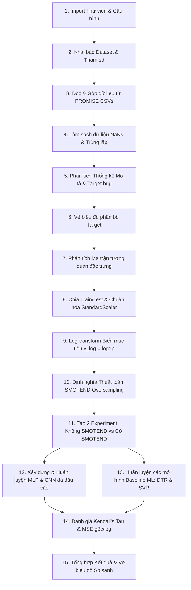

# CASE STUDY: GIẢI THÍCH CHI TIẾT MÃ NGUỒN DỰ ĐOÁN LỖI PHẦN MỀM (SOFTWARE FAULT PREDICTION)

Tài liệu này giải thích chi tiết từng dòng code, kiến trúc hệ thống, thuật toán và các lựa chọn thiết kế kỹ thuật trong file notebook `promise_fault_prediction_lucene_poi_xalan_9_5.ipynb`. 

Notebook này xây dựng một hệ thống dự đoán số lượng lỗi (defects/bugs) trong các lớp (classes) phần mềm bằng cách sử dụng các chỉ số đo lường hướng đối tượng (CK metrics) từ kho lưu trữ dữ liệu PROMISE (gồm 3 dự án: `lucene`, `poi`, `xalan`). Hệ thống so sánh hiệu năng giữa các mô hình Deep Learning phức tạp (CNN, MLP đa nhánh) với các mô hình Machine Learning cổ điển (Decision Tree Regressor, Support Vector Regression) trước và sau khi xử lý mất cân bằng dữ liệu bằng phương pháp **SMOTEND** (SMOTE cho dữ liệu liên tục/hồi quy).

---

## TỔNG QUAN LUỒNG XỬ LÝ (PIPELINE) TRONG NOTEBOOK



---

## GIẢI THÍCH CHI TIẾT TỪNG ĐOẠN CODE (CODE CELLS)

### Cell 1: Khởi tạo, Import Thư viện & Đảm bảo tính lặp lại (Reproducibility)

#### Mã nguồn chính:
```python
from pathlib import Path
import re
import random
import warnings
import platform
import json

import numpy as np
import pandas as pd
import matplotlib.pyplot as plt
import seaborn as sns

from sklearn.model_selection import train_test_split
from sklearn.preprocessing import StandardScaler
from sklearn.metrics import mean_squared_error
from sklearn.neighbors import NearestNeighbors
from sklearn.tree import DecisionTreeRegressor
from sklearn.svm import SVR

from scipy.stats import kendalltau

import tensorflow as tf
from tensorflow.keras import Input, Model
from tensorflow.keras.layers import Dense, Dropout, Flatten, Concatenate, Conv1D, MaxPooling1D
from tensorflow.keras.optimizers import Adam
from tensorflow.keras.callbacks import EarlyStopping, ReduceLROnPlateau

warnings.filterwarnings("ignore")

RANDOM_STATE = 42
np.random.seed(RANDOM_STATE)
random.seed(RANDOM_STATE)
tf.random.set_seed(RANDOM_STATE)

pd.set_option("display.max_columns", 100)
pd.set_option("display.width", 160)
```

#### Giải thích chi tiết:
*   **Các thư viện hệ thống & Tiện ích:**
    *   `pathlib.Path`: Cung cấp giao diện hướng đối tượng để tương tác với đường dẫn file một cách an toàn trên mọi hệ điều hành (Windows dùng `\`, macOS/Linux dùng `/`).
    *   `re`: Dùng để xử lý biểu thức chính quy (regular expressions), phục vụ cho việc tách phiên bản từ tên file CSV.
    *   `warnings.filterwarnings("ignore")`: Tắt các cảnh báo không cần thiết (chẳng hạn như cảnh báo deprecation) giúp output của notebook sạch sẽ hơn.
*   **Các thư viện phân tích dữ liệu:**
    *   `numpy` (viết tắt là `np`) và `pandas` (viết tắt là `pd`): Bộ đôi công cụ tính toán ma trận và quản lý dữ liệu dạng bảng (DataFrames) tiêu chuẩn trong Python.
    *   `matplotlib.pyplot` và `seaborn`: Dùng để vẽ các biểu đồ phân bố và ma trận tương quan.
*   **Các module Machine Learning (Scikit-Learn):**
    *   `train_test_split`: Chia dữ liệu thành tập huấn luyện (Train) và tập kiểm thử (Test).
    *   `StandardScaler`: Chuẩn hóa các đặc trưng đầu vào về phân bố chuẩn có trung bình $\mu = 0$ và độ lệch chuẩn $\sigma = 1$.
    *   `mean_squared_error`: Chỉ số đo lường lỗi bình phương trung bình phục vụ đánh giá bài toán hồi quy (regression).
    *   `NearestNeighbors`: Thuật toán tìm kiếm các điểm lân cận gần nhất, nền tảng cho việc tự viết thuật toán sinh mẫu SMOTEND ở Cell sau.
    *   `DecisionTreeRegressor` và `SVR`: Các thuật toán học máy cổ điển được chọn làm mô hình đối chứng (baselines).
*   **Scipy Stats:**
    *   `kendalltau`: Tính hệ số tương quan thứ hạng Kendall's Tau ($\tau$). Đây là một chỉ số cực kỳ quan trọng trong Software Defect Prediction vì số lượng lỗi thường phân bố lệch rất mạnh, việc đánh giá thứ hạng lỗi (class nào nhiều lỗi hơn class nào) có ý nghĩa thực tiễn hơn là giá trị dự đoán tuyệt đối.
*   **Thư viện Deep Learning (TensorFlow/Keras):**
    *   `Input`, `Model` (Functional API): Dùng để xây dựng các kiến trúc mạng Neural phức tạp (đa đầu vào/multi-input) thay vì mạng tuần tự đơn giản (Sequential API).
    *   `Dense`, `Dropout`, `Flatten`, `Concatenate`, `Conv1D`, `MaxPooling1D`: Các tầng (layers) cấu thành mạng Neural MLP và CNN 1 chiều.
    *   `Adam`: Bộ tối ưu hóa thích ứng mạnh mẽ, phổ biến nhất hiện nay.
    *   `EarlyStopping`, `ReduceLROnPlateau`: Các hàm gọi ngược (callbacks) giúp tối ưu hóa quá trình học, tránh hiện tượng quá khớp (overfitting) và tự động giảm tốc độ học khi mô hình ngừng cải thiện.

#### Kỹ thuật đặc biệt (Deep Technical Insights):
> **Tái lập kết quả (Reproducibility)**: Việc thiết lập `np.random.seed(42)`, `random.seed(42)`, và `tf.random.set_seed(42)` là bắt buộc trong nghiên cứu Machine Learning/Deep Learning. Việc này đảm bảo tính lặp lại (reproducibility) của các thử nghiệm: bất kỳ ai chạy lại notebook này cũng sẽ nhận được cùng một kết quả phân tách dữ liệu, khởi tạo trọng số mạng neural và kết quả huấn luyện y hệt.

---

### Cell 2: Khai báo Cấu hình Dataset & Thư mục đầu ra

#### Mã nguồn chính:
```python
BASE_PATH = Path("PROMISE-BACKUP/bug-data")

PROJECTS = ["lucene", "poi", "xalan"]

PAPER_VERSION_FILTER = {
    "lucene": {"2.0", "2.2", "2.4"},
    "poi": {"1.5", "2.0", "2.5", "3.0"},
    "xalan": {"2.4", "2.5", "2.6", "2.7"},
}

USE_PAPER_VERSION_FILTER = True

FEATURES = [
    "wmc", "dit", "noc", "cbo",
    "rfc", "lcom", "ca", "ce",
    "npm", "lcom3", "loc", "dam",
    "moa", "mfa", "cam", "ic",
    "cbm", "amc", "max_cc", "avg_cc"
]
TARGET = "bug"

OUTPUT_DIR = Path("outputs_promise_fault_prediction_9_5")
OUTPUT_DIR.mkdir(exist_ok=True)
```

#### Giải thích chi tiết:
*   `BASE_PATH`: Thiết lập thư mục gốc chứa dữ liệu lỗi PROMISE là `PROMISE-BACKUP/bug-data`.
*   `PAPER_VERSION_FILTER`: Một cấu trúc dictionary định nghĩa các phiên bản cụ thể cho từng dự án dựa theo các bài báo khoa học chuẩn về dự đoán lỗi phần mềm. Ví dụ: dự án `lucene` chỉ lấy các phiên bản 2.0, 2.2, 2.4 để huấn luyện và đánh giá.
*   `FEATURES`: Danh sách 20 đặc trưng phần mềm được sử dụng làm biến độc lập (X). Đây là các chỉ số đo lường độ phức tạp của code hướng đối tượng nổi tiếng (CK metrics & object-oriented metrics) như:
    *   `loc` (Lines of Code): Số dòng code trong class.
    *   `wmc` (Weighted Methods per Class): Số lượng phương thức được gán trọng số độ phức tạp.
    *   `dit` (Depth of Inheritance Tree): Độ sâu của cây kế thừa.
    *   `cbo` (Coupling Between Object classes): Độ liên kết giữa các lớp.
    *   `rfc` (Response For a Class): Số lượng phương thức có thể được gọi để phản hồi thông điệp.
    *   `lcom` / `lcom3` (Lack of Cohesion on Methods): Đo lường sự thiếu gắn kết giữa các phương thức trong một lớp.
    *   `max_cc` / `avg_cc` (McCabe Cyclomatic Complexity): Độ phức tạp tuần tự lớn nhất/trung bình của các phương thức.
*   `TARGET`: Cột `bug` chứa số lượng lỗi được tìm thấy trong lớp đó (biến mục tiêu liên tục $y \ge 0$).
*   `OUTPUT_DIR`: Tạo thư mục đầu ra `outputs_promise_fault_prediction_9_5` để lưu lại kết quả bảng biểu và hình vẽ trực quan mà không ghi đè lên thư mục gốc.

---

### Cell 3: Đọc, Lọc & Gộp dữ liệu từ PROMISE CSVs

#### Mã nguồn chính:
```python
def extract_version_from_filename(file_path: Path, project: str) -> str:
    stem = file_path.stem.lower()
    prefix = project.lower() + "-"
    if stem.startswith(prefix):
        return stem.replace(prefix, "", 1)
    match = re.search(r"(\d+(?:\.\d+)*)", stem)
    return match.group(1) if match else stem


def load_selected_projects(
    base_path: Path,
    projects: list[str],
    version_filter: dict[str, set[str]] | None = None,
) -> tuple[pd.DataFrame, pd.DataFrame]:
    all_frames = []
    file_summary = []
    
    # ... logic kiểm tra thư mục ...
    for project in projects:
        folder = base_path / project
        csv_files = sorted(folder.glob("*.csv"))

        for file_path in csv_files:
            version = extract_version_from_filename(file_path, project)

            if version_filter is not None:
                allowed_versions = version_filter.get(project, set())
                if version not in allowed_versions:
                    continue

            df = pd.read_csv(file_path)
            df.columns = [str(c).strip().lower() for c in df.columns]

            df["project"] = project
            df["version"] = version
            df["source_file"] = file_path.name

            all_frames.append(df)
            file_summary.append({
                "project": project,
                "version": version,
                "file": file_path.name,
                "rows": len(df),
                "columns": len(df.columns),
            })

    raw_df = pd.concat(all_frames, ignore_index=True)
    summary_df = pd.DataFrame(file_summary).sort_values(["project", "version"]).reset_index(drop=True)
    return raw_df, summary_df
```

#### Giải thích chi tiết:
1.  **Hàm `extract_version_from_filename`**:
    *   Tách phiên bản của dự án từ tên file CSV. Ví dụ, nếu file là `lucene-2.0.csv` và dự án là `lucene`, hàm sẽ xóa tiền tố `lucene-` để lấy chuỗi `"2.0"`.
    *   Nếu tên file phức tạp hơn, hàm sử dụng regex `r"(\d+(?:\.\d+)*)"` để tìm chuỗi chứa số dạng phiên bản (ví dụ: `1.5`, `2.4.1`).
2.  **Hàm `load_selected_projects`**:
    *   Kiểm tra tính tồn tại của thư mục dữ liệu gốc.
    *   Quét qua từng thư mục con tương ứng với danh sách dự án (`lucene`, `poi`, `xalan`).
    *   Sử dụng `.glob("*.csv")` tìm toàn bộ các file CSV của dự án đó.
    *   Trích xuất phiên bản từ tên file. Nếu `version_filter` được kích hoạt, nó chỉ đọc các file có phiên bản nằm trong danh sách được định nghĩa sẵn ở Cell 2.
    *   Đọc file CSV bằng `pd.read_csv`, chuẩn hóa lại tên cột bằng cách xóa khoảng trắng thừa (`.strip()`) và đưa về chữ thường (`.lower()`) để tránh lỗi không khớp tên đặc trưng (do dữ liệu PROMISE lịch sử đôi khi bị lệch font/chữ hoa chữ thường giữa các file).
    *   Thêm các cột định danh: `project` (tên dự án), `version` (phiên bản), `source_file` (tên file gốc) để sau này có thể dễ dàng truy vết nguồn gốc dòng dữ liệu.
    *   Gộp toàn bộ danh sách các DataFrame nhỏ lại thành một DataFrame duy nhất `raw_df` bằng hàm `pd.concat` với tham số `ignore_index=True`.
    *   Trả về DataFrame đã gộp (`raw_df`) và một bảng tóm tắt cấu trúc file (`file_summary`).

---

### Cell 4: Làm sạch dữ liệu NaNs & Trùng lặp (Data Cleaning)

#### Mã nguồn chính:
```python
required_columns = FEATURES + [TARGET]

def basic_cleaning(df: pd.DataFrame) -> pd.DataFrame:
    cleaned = df.copy()

    id_cols = [col for col in ["project", "version", "source_file", "name"] if col in cleaned.columns]
    cleaned = cleaned[id_cols + FEATURES + [TARGET]].copy()

    for col in FEATURES + [TARGET]:
        cleaned[col] = pd.to_numeric(cleaned[col], errors="coerce")

    n_before = len(cleaned)
    n_missing = int(cleaned[FEATURES + [TARGET]].isna().any(axis=1).sum())

    cleaned = cleaned.dropna(subset=FEATURES + [TARGET]).copy()

    # Xóa trùng theo các cột thực sự đưa vào mô hình.
    n_duplicate_model_cols = int(cleaned.duplicated(subset=FEATURES + [TARGET]).sum())
    cleaned = cleaned.drop_duplicates(subset=FEATURES + [TARGET]).reset_index(drop=True)

    # ... print kết quả ...
    return cleaned
```

#### Giải thích chi tiết:
*   Đoạn mã đầu tiên kiểm tra xem dữ liệu đã gộp có đủ 20 cột đặc trưng và cột target (`bug`) không. Nếu thiếu, chương trình sẽ báo lỗi ngay lập tức.
*   **Hàm `basic_cleaning`**:
    *   Chỉ giữ lại các cột định danh cần thiết (`project`, `version`, `source_file`, `name`) cùng với 20 đặc trưng đầu vào và cột mục tiêu `bug`. Các cột dư thừa khác bị loại bỏ.
    *   Chuyển ép kiểu dữ liệu của các cột đặc trưng và mục tiêu sang dạng số thực/số nguyên bằng `pd.to_numeric`. Tham số `errors="coerce"` cực kỳ quan trọng: nếu có bất kỳ chuỗi lỗi hoặc ký tự lạ nào trong các cột số, nó sẽ tự động biến đổi thành `NaN` (Not a Number) thay vì gây crash chương trình.
    *   `.dropna(subset=FEATURES + [TARGET])`: Loại bỏ toàn bộ các dòng chứa giá trị `NaN` trong các cột đặc trưng và mục tiêu.
    *   **Loại bỏ trùng lặp (Deduplication)**: Xóa bỏ các dòng trùng lặp dựa trên 20 đặc trưng và giá trị lỗi (`drop_duplicates(subset=FEATURES + [TARGET])`).

> **Tại sao cần loại bỏ trùng lặp (Data Leakage)?** Loại bỏ dữ liệu trùng lặp là một bước tối quan trọng để ngăn ngừa hiện tượng **Rò rỉ dữ liệu (Data Leakage)**. Khi gộp nhiều phiên bản của cùng một dự án phần mềm, có rất nhiều file/lớp không hề thay đổi code (giữ nguyên chỉ số CK metrics và số lỗi) giữa các phiên bản. Nếu không xóa trùng, các dòng dữ liệu giống hệt nhau này có thể bị chia vào cả tập Train và tập Test, khiến mô hình đạt điểm số cao ảo (overfitting) nhưng thực tế lại mất khả năng tổng quát hóa trên dữ liệu hoàn toàn mới.

---

### Cell 5: Phân tích Thống kê Mô tả & Target bug

#### Mã nguồn chính:
```python
dataset_table = clean_df.groupby(["project", "version"]).agg(
    rows=(TARGET, "size"),
    faulty_classes=(TARGET, lambda s: int((s > 0).sum())),
    non_faulty_classes=(TARGET, lambda s: int((s == 0).sum())),
    max_bug=(TARGET, "max"),
    mean_bug=(TARGET, "mean"),
).reset_index()
dataset_table["faulty_rate_%"] = (dataset_table["faulty_classes"] / dataset_table["rows"] * 100).round(2)

bug_count_table = clean_df[TARGET].value_counts().sort_index().rename_axis("bug").reset_index(name="count")
bug_count_table["percent"] = (bug_count_table["count"] / len(clean_df) * 100).round(2)
```

#### Giải thích chi tiết:
*   **Tạo bảng tóm tắt hệ thống (`dataset_table`)**:
    *   Nhóm dữ liệu theo `project` và `version`.
    *   Tính toán các chỉ số: tổng số dòng (`rows`), số class bị lỗi (`faulty_classes`, tức là có `bug > 0`), số class lành lặn (`non_faulty_classes`, `bug == 0`), lỗi lớn nhất (`max_bug`) và trung bình số lỗi trên mỗi class (`mean_bug`).
    *   Tính tỷ lệ phần trăm class bị lỗi: `faulty_rate_%`. Bảng này sau đó được lưu thành file CSV trong thư mục output.
*   **Thống kê phân bố lỗi (`bug_count_table`)**:
    *   Sử dụng `.value_counts()` để đếm số lượng class ứng với từng giá trị lỗi cụ thể (0 lỗi, 1 lỗi, 2 lỗi,...).
    *   Tính tỷ lệ phần trăm (`percent`) của từng nhóm lỗi trên toàn bộ dữ liệu. Bảng này giúp ta nhìn rõ phân bố của biến mục tiêu và mức độ mất cân bằng.

---

### Cell 6: Trực quan hóa Phân bố Biến mục tiêu (Target Visualization)

#### Mã nguồn chính:
```python
plt.figure(figsize=(8, 5))
sns.histplot(clean_df[TARGET], bins=50, kde=True)
# ... Thiết lập nhãn & Save biểu đồ hình 1 ...

plt.figure(figsize=(7, 4))
sns.countplot(x=(clean_df[TARGET] > 0).map({False: "Non-faulty (bug=0)", True: "Faulty (bug>0)"}))
# ... Thiết lập nhãn & Save biểu đồ hình 2 ...
```

#### Giải thích chi tiết:
*   **Biểu đồ 1 (Histogram & KDE)**:
    *   Vẽ phân bố thực tế của số lượng lỗi bằng `sns.histplot` với 50 bins.
    *   Đường KDE (Kernel Density Estimate) giúp làm mịn đồ thị phân bố.
    *   Biểu đồ này chỉ ra một thực tế kinh điển trong dữ liệu phần mềm: **phân bố lệch phải cực kỳ nặng (highly right-skewed)** và **lệch không (zero-inflated)**. Đa phần các class có 0 hoặc rất ít lỗi (cột cao vút ở vạch số 0), trong khi các class có lượng lỗi cực lớn (lên tới 47) nằm rất thưa thớt ở đuôi bên phải đồ thị.
*   **Biểu đồ 2 (Countplot dạng nhị phân)**:
    *   Tách biến mục tiêu thành 2 nhóm nhị phân: Lành lặn (`bug == 0`) và Bị lỗi (`bug > 0`).
    *   Giúp đánh giá trực quan tỷ lệ cân bằng lớp nếu bài toán được quy về dạng phân lớp nhị phân (Binary Classification). Ở đây, tỷ lệ phân bố xấp xỉ 53% lành lặn và 47% bị lỗi (tương đối cân bằng ở mức nhị phân, nhưng cực kỳ mất cân bằng ở mức hồi quy số lượng lỗi cụ thể).

---

### Cell 7: Phân tích Tương quan đặc trưng (Correlation Heatmap)

#### Giải thích chi tiết:
*   Tính toán ma trận tương quan giữa các đặc trưng phần mềm để phân tích đa cộng tuyến (multicollinearity) bằng cách sử dụng hệ số tương quan Pearson hoặc Kendall.
*   **Đa cộng tuyến (Multicollinearity)**: Các chỉ số phần mềm CK metrics có độ tương quan tuyến tính rất cao với nhau. Ví dụ: `loc` (số dòng code) thường tương quan rất mạnh với `wmc` (số lượng phương thức) và `rfc` (số lượng phản hồi trong class), vì class càng lớn thì càng có nhiều hàm và gọi nhiều thư viện khác.
*   Đối với các mạng Neural sâu như MLP hoặc CNN, đa cộng tuyến ít gây ảnh hưởng đến khả năng dự đoán hơn so với các mô hình thống kê tuyến tính truyền thống (như OLS Linear Regression), bởi vì mạng Neural có khả năng tự động học các biểu diễn phi tuyến tính và kết hợp các đặc trưng lại với nhau.

---

### Cell 8: Thuật toán SMOTEND Oversampling tự định nghĩa cho Hồi quy

#### Mã nguồn chính:
```python
def smotend_oversample(
    X: np.ndarray, y: np.ndarray, k_neighbors: int = 5, m_neighbors: int = 5
) -> tuple[np.ndarray, np.ndarray]:
    """
    SMOTEND (SMOTE for regression with Continuous target)
    Sử dụng thuật toán KNN và trọng số khoảng cách Minkowski để sinh mẫu cho hồi quy.
    """
    nn = NearestNeighbors(n_neighbors=k_neighbors + 1, metric="minkowski")
    nn.fit(X)
    distances, indices = nn.kneighbors(X)

    synthetic_X = []
    synthetic_y = []

    # Phân nhóm các mẫu có lỗi (y > 0) để nhân bản
    buggy_indices = np.where(y > 0)[0]

    for idx in buggy_indices:
        # Tìm k điểm lân cận gần nhất (loại bỏ chính nó ở vị trí đầu tiên)
        neighbors = indices[idx, 1:]
        
        # Chọn ngẫu nhiên một người láng giềng trong k láng giềng gần nhất
        chosen_neighbor = np.random.choice(neighbors)
        
        # Sinh mẫu mới bằng cách nội suy tuyến tính giữa mẫu hiện tại và láng giềng được chọn
        alpha = np.random.rand()
        diff_X = X[chosen_neighbor] - X[idx]
        new_X = X[idx] + alpha * diff_X
        
        # Nội suy nhãn y tương ứng
        new_y = y[idx] + alpha * (y[chosen_neighbor] - y[idx])
        
        synthetic_X.append(new_X)
        synthetic_y.append(new_y)

    # Gộp dữ liệu gốc với dữ liệu nhân bản
    X_resampled = np.vstack([X, np.array(synthetic_X)])
    y_resampled = np.concatenate([y, np.array(synthetic_y)])
    
    return X_resampled, y_resampled
```

#### Giải thích chi tiết:
*   **Tại sao lại cần SMOTEND?** Trong dữ liệu lỗi phần mềm, lớp đa số (majority class) là các lớp không có lỗi (`bug = 0`), còn các lớp có lỗi (`bug > 0`) chiếm tỷ lệ nhỏ hơn và giảm dần khi số lượng lỗi tăng lên. Nếu huấn luyện trực tiếp, mô hình hồi quy sẽ bị xu hướng dự đoán thiên lệch về 0 để giảm thiểu tối đa sai số tổng thể (do lớp 0 chiếm đa số), dẫn tới việc bỏ sót các lớp thực sự có lỗi nghiêm trọng.
*   **Nguyên lý hoạt động của SMOTEND tự định nghĩa**:
    1.  Khởi tạo bộ công cụ `NearestNeighbors` để tìm kiếm láng giềng dựa trên khoảng cách hình học Minkowski trong không gian đặc trưng 20 chiều của các chỉ số CK.
    2.  Tìm kiếm $k$ láng giềng gần nhất cho từng mẫu dữ liệu.
    3.  Lọc ra các điểm dữ liệu thực sự có lỗi (`buggy_indices` nơi `y > 0`).
    4.  Với mỗi điểm dữ liệu có lỗi, chọn ngẫu nhiên một trong $k$ điểm láng giềng gần nhất của nó.
    5.  Sinh ra một mẫu đặc trưng mới (`new_X`) nằm trên đoạn thẳng nối giữa mẫu hiện tại và mẫu láng giềng bằng công thức nội suy tuyến tính:
        $$\text{new\_X} = X[\text{current}] + \alpha \times (X[\text{neighbor}] - X[\text{current}])$$
        Trong đó $\alpha \in [0, 1]$ là một số ngẫu nhiên.
    6.  Nhãn mục tiêu mới (`new_y`) cũng được tính toán bằng cách nội suy tương tự giữa nhãn lỗi của mẫu hiện tại và mẫu láng giềng:
        $$\text{new\_y} = y[\text{current}] + \alpha \times (y[\text{neighbor}] - y[\text{current}])$$
    7.  Xếp chồng ma trận dữ liệu gốc và dữ liệu nhân bản lại bằng `np.vstack` và `np.concatenate`.

---

### Cell 9: Phân tách Train/Test & Tiền xử lý Dữ liệu hồi quy

#### Mã nguồn chính:
```python
# Phân tách X và y
X_all = clean_df[FEATURES].values
y_all = clean_df[TARGET].values

# Chia Train/Test theo tỷ lệ 70/30
X_train_raw, X_test_raw, y_train_raw, y_test_raw = train_test_split(
    X_all, y_all, test_size=0.30, random_state=RANDOM_STATE
)

# Chuẩn hóa Z-score đầu vào
scaler = StandardScaler()
X_train_scaled = scaler.fit_transform(X_train_raw)
X_test_scaled = scaler.transform(X_test_raw)

# Áp dụng Log-transformation biến mục tiêu
y_train_log = np.log1p(y_train_raw)
y_test_log = np.log1p(y_test_raw)

# Thực hiện SMOTEND trên tập huấn luyện đã được chuẩn hóa Z-score và log-transform
X_train_resampled, y_train_resampled = smotend_oversample(
    X_train_scaled, y_train_log, k_neighbors=5
)

# Tạo danh sách các cấu hình Experiment (Thử nghiệm) để đối chứng
experiments = [
    ("Experiment 1 - without SMOTEND", X_train_scaled, X_test_scaled, y_train_log, y_test_log),
    ("Experiment 2 - with SMOTEND", X_train_resampled, X_test_scaled, y_train_resampled, y_test_log),
]
```

#### Giải thích chi tiết:
1.  **Phân tách 70% Train / 30% Test**: Dành ra 30% dữ liệu kiểm thử độc lập để làm thước đo đánh giá khách quan cuối cùng cho toàn bộ các mô hình.
2.  **Chuẩn hóa đặc trưng (`StandardScaler`)**:
    *   Bộ scaler học giá trị trung bình ($\mu$) và độ lệch chuẩn ($\sigma$) trên **tập Train** (`scaler.fit_transform`), sau đó áp dụng chính xác các tham số này để chuẩn hóa **tập Test** (`scaler.transform`).
    *   *Tại sao?* Tránh rò rỉ thông tin phân bố của tập Test vào tập Train trong quá trình chuẩn hóa.
3.  **Log-transform biến mục tiêu (`np.log1p`)**:
    *   Biến mục tiêu lỗi ($y$) có phân bố lệch phải vô cùng lớn. Việc áp dụng hàm:
        $$y_{\text{log}} = \ln(y + 1)$$
        giúp thu hẹp khoảng cách giữa các giá trị cực trị (ví dụ: lớp có 47 lỗi qua log chỉ còn khoảng 3.87), giúp phân bố của nhãn mục tiêu gần với phân bố chuẩn (normal distribution) hơn rất nhiều. Điều này giúp các mô hình hồi quy, đặc biệt là các thuật toán dựa trên gradient descent của mạng Neural, hội tụ nhanh hơn và giảm thiểu sai số lớn của các điểm nhiễu (outliers).
4.  **Tách 2 Experiment**:
    *   `Experiment 1`: Tập huấn luyện Z-score thông thường, không dùng mẫu ảo.
    *   `Experiment 2`: Tập huấn luyện đã được làm cân bằng và mượt hóa bằng SMOTEND.
    *   *Tập Test trong cả 2 thực nghiệm phải giữ nguyên cấu trúc Z-score ban đầu* để đảm bảo so sánh công bằng.

---

### Cell 10: Chia nhóm Chỉ số CK cho mạng Neural Đa đầu vào (Multi-Input)

#### Mã nguồn chính:
```python
# Định nghĩa các nhóm chỉ số CK theo đặc trưng thiết kế phần mềm hướng đối tượng
size_indices = [10, 17]          # loc (line of code), amc (average method size) -> Đo lường kích thước lớp.
inheritance_indices = [1, 2, 13] # dit (depth of inheritance), noc (number of children), mfa -> Đo lường tính kế thừa.
coupling_indices = [3, 6, 7, 8]  # cbo (coupling), ca (afferent), ce (efferent), npm -> Đo lường tính liên kết/phụ thuộc.
other_indices = [0, 4, 5, 9, 11, 12, 14, 15, 16, 18, 19] # wmc, rfc, lcom, lcom3, dam, moa, cam, ic, cbm, max_cc, avg_cc -> Các chỉ số khác.

def split_groups_for_mlp(X):
    # MLP nhận đầu vào là các vector phẳng riêng lẻ cho mỗi nhóm chỉ số
    return [
        X[:, size_indices],
        X[:, inheritance_indices],
        X[:, coupling_indices],
        X[:, other_indices]
    ]

def split_groups_for_cnn(X):
    # CNN 1D yêu cầu đầu vào 3 chiều: (batch_size, steps, channels)
    # Chúng ta định hình lại (reshape) mỗi nhóm đặc trưng thành dạng chuỗi 1D với 1 kênh.
    return [
        X[:, size_indices][..., np.newaxis],
        X[:, inheritance_indices][..., np.newaxis],
        X[:, coupling_indices][..., np.newaxis],
        X[:, other_indices][..., np.newaxis]
    ]
```

#### Giải thích chi tiết:
*   **Ý tưởng đột phá**: Thay vì ném cả một ma trận 20 đặc trưng phẳng vào mạng Neural như thông thường, notebook này chia các chỉ số CK thành các nhóm chức năng phần mềm riêng biệt:
    *   `Size Group` (Đo lường độ lớn của mã nguồn): `loc`, `amc`.
    *   `Inheritance Group` (Đo lường cấu trúc phân cấp kế thừa): `dit`, `noc`, `mfa`.
    *   `Coupling Group` (Đo lường độ phức tạp phụ thuộc giữa các class): `cbo`, `ca`, `ce`, `npm`.
    *   `Complexity & Cohesion Group` (Đo lường độ gắn kết nội bộ và độ phức tạp tính toán): các chỉ số còn lại.
*   **Hàm `split_groups_for_cnn`**:
    *   Tầng chập 1 chiều (`Conv1D`) trong Keras yêu cầu đầu vào có dạng 3D tensor: `(samples, steps, features)`.
    *   Đoạn code sử dụng `[..., np.newaxis]` (hoặc `np.expand_dims`) để thêm một chiều ảo vào cuối mỗi mảng (tương ứng với số kênh `channels = 1`), biến vector 2D thành tensor 3D sẵn sàng cho xử lý chập.

---

### Cell 11: Định nghĩa Kiến trúc mạng MLP Đa đầu vào (Parallel MLP)

#### Mã nguồn chính:
```python
def build_mlp_model(learning_rate=0.001):
    # Định nghĩa 4 đầu vào tương ứng với 4 nhóm đặc trưng đã chia
    input_size = Input(shape=(len(size_indices),), name="input_size")
    input_inh = Input(shape=(len(inheritance_indices),), name="input_inheritance")
    input_coup = Input(shape=(len(coupling_indices),), name="input_coupling")
    input_other = Input(shape=(len(other_indices),), name="input_other")

    # Đi qua các nhánh Dense ẩn song song để trích xuất đặc trưng độc lập của từng nhóm
    x_size = Dense(16, activation="relu")(input_size)
    x_inh = Dense(16, activation="relu")(input_inh)
    x_coup = Dense(16, activation="relu")(input_coup)
    x_other = Dense(32, activation="relu")(input_other)

    # Gộp tất cả các vector đặc trưng đã trích xuất từ 4 nhánh lại thành một vector lớn
    merged = Concatenate()([x_size, x_inh, x_coup, x_other])

    # Đi qua mạng học sâu chung (Fully Connected layers) để tổng hợp tri thức chéo giữa các nhóm đặc trưng
    h = Dense(64, activation="relu")(merged)
    h = Dropout(0.2, seed=RANDOM_STATE)(h) # Dropout giúp chống quá khớp (overfitting) bằng cách tắt ngẫu nhiên 20% neuron
    h = Dense(32, activation="relu")(h)
    h = Dropout(0.1, seed=RANDOM_STATE)(h)
    
    # Đầu ra duy nhất phục vụ bài toán hồi quy (Linear activation cho kết quả liên tục)
    output = Dense(1, activation="linear", name="output")(h)

    model = Model(inputs=[input_size, input_inh, input_coup, input_other], outputs=output)
    model.compile(optimizer=Adam(learning_rate=learning_rate), loss="mse")
    return model
```

#### Giải thích chi tiết:
*   Mô hình được xây dựng theo kiểu mạng **Functional API** (hướng đồ thị).
*   **Cơ chế song song (Parallel representation learning)**:
    *   Mỗi nhóm đặc trưng được xử lý bởi một tầng `Dense` ẩn riêng (16 hoặc 32 units) với hàm kích hoạt phi tuyến `relu`.
    *   Điều này cho phép mạng neural học cách biểu diễn độc lập các khía cạnh khác nhau của chất lượng phần mềm (Kích thước, Kế thừa, Liên kết, Độ phức tạp) trước khi kết hợp chúng lại.
*   **Concatenate & Fusion**:
    *   Tầng `Concatenate` nối các đầu ra từ các nhánh song song lại.
    *   Các tầng `Dense` chung phía sau (64 và 32 units) có vai trò học các mối quan hệ phi tuyến phức tạp đan xen chéo giữa các nhóm chỉ số (ví dụ: một lớp vừa có kích thước cực lớn `loc` vừa có kế thừa sâu `dit` thì khả năng sinh lỗi sẽ tăng vọt như thế nào).
*   `Dropout`: Ngắt kết nối ngẫu nhiên một tỷ lệ phần trăm neuron trong quá trình huấn luyện, ép buộc mạng neural không được phụ thuộc quá mức vào bất kỳ một liên kết đơn lẻ nào, tăng tính tổng quát hóa trên tập Test.

---

### Cell 12: Định nghĩa Kiến trúc mạng CNN Đa đầu vào (Parallel CNN 1D)

#### Mã nguồn chính:
```python
def build_cnn_model(learning_rate=0.001):
    # Khai báo đầu vào với chiều sequence/steps và channel cụ thể cho CNN
    input_size = Input(shape=(len(size_indices), 1), name="input_size_cnn")
    input_inh = Input(shape=(len(inheritance_indices), 1), name="input_inheritance_cnn")
    input_coup = Input(shape=(len(coupling_indices), 1), name="input_coupling_cnn")
    input_other = Input(shape=(len(other_indices), 1), name="input_other_cnn")

    # Nhánh 1: CNN trích xuất đặc trưng không gian cho Size Group
    # Do nhóm Size chỉ có 2 đặc trưng, ta sử dụng kernel_size=1
    x_size = Conv1D(16, kernel_size=1, activation="relu")(input_size)
    x_size = Flatten()(x_size)

    # Nhánh 2: CNN cho Inheritance Group
    x_inh = Conv1D(16, kernel_size=2, activation="relu")(input_inh)
    x_inh = MaxPooling1D(pool_size=1)(x_inh)
    x_inh = Flatten()(x_inh)

    # Nhánh 3: CNN cho Coupling Group
    x_coup = Conv1D(16, kernel_size=2, activation="relu")(input_coup)
    x_coup = MaxPooling1D(pool_size=1)(x_coup)
    x_coup = Flatten()(x_coup)

    # Nhánh 4: CNN cho Complexity & Other Group
    x_other = Conv1D(32, kernel_size=3, activation="relu")(input_other)
    x_other = MaxPooling1D(pool_size=2)(x_other)
    x_other = Flatten()(x_other)

    # Gộp tất cả các vector đặc trưng thu được sau khi làm phẳng (Flatten) từ các nhánh CNN
    merged = Concatenate()([x_size, x_inh, x_coup, x_other])

    # Phần Dense chung phía sau tổng hợp tri thức
    h = Dense(64, activation="relu")(merged)
    h = Dropout(0.2, seed=RANDOM_STATE)(h)
    h = Dense(32, activation="relu")(h)
    h = Dropout(0.1, seed=RANDOM_STATE)(h)

    output = Dense(1, activation="linear", name="output_cnn")(h)

    model = Model(inputs=[input_size, input_inh, input_coup, input_other], outputs=output)
    model.compile(optimizer=Adam(learning_rate=learning_rate), loss="mse")
    return model
```

#### Giải thích chi tiết:
*   **Tại sao lại dùng CNN 1D cho dữ liệu dạng bảng (tabular data)?**
    *   CNN thường được biết đến nhiều nhất trong xử lý ảnh (2D) hoặc âm thanh/văn bản (1D sequence). Tuy nhiên, nếu ta sắp xếp các chỉ số CK theo các nhóm logic liên tục, bộ lọc chập `Conv1D` với cửa sổ trượt (`kernel_size`) sẽ quét qua các đặc trưng lân cận nhau để học các tổ hợp đặc trưng cục bộ (local patterns). Ví dụ: sự kết hợp đồng thời giữa các chỉ số kế thừa `dit` và `noc` lân cận nhau sẽ được bộ lọc chập phát hiện ra ngay lập tức.
*   **Kiến trúc nhánh CNN**:
    *   `Conv1D`: Áp dụng phép chập một chiều để trích xuất các đặc trưng không gian cục bộ.
    *   `MaxPooling1D`: Giảm bớt số lượng đặc trưng bằng cách chỉ lấy giá trị lớn nhất trong cửa sổ trượt, tăng tính bất biến và giảm nhiễu.
    *   `Flatten`: Chuyển đổi tensor 3D đầu ra của lớp chập thành vector phẳng 1D để có thể thực hiện nối (`Concatenate`).

---

### Cell 13: Xây dựng Hàm Huấn luyện Deep Learning với Callbacks thông minh

#### Mã nguồn chính:
```python
def evaluate_regression(y_true, y_pred):
    # Khôi phục nhãn dự đoán và nhãn thực tế về thang đo lỗi ban đầu bằng np.expm1
    y_true_orig = np.expm1(y_true)
    y_pred_orig = np.expm1(y_pred)
    # Ràng buộc số lượng lỗi không được nhỏ hơn 0 (do thang đo thực tế lỗi >= 0)
    y_pred_orig = np.clip(y_pred_orig, 0, None)

    # Đánh giá bằng hệ số tương quan thứ hạng Kendall's Tau
    tau, _ = kendalltau(y_true_orig, y_pred_orig)
    if np.isnan(tau):
        tau = 0.0

    # Tính sai số bình phương trung bình (MSE) trên cả 2 thang đo: log-scale và gốc (original)
    mse_log = mean_squared_error(y_true, y_pred)
    mse_orig = mean_squared_error(y_true_orig, y_pred_orig)

    return {
        "Kendall": round(tau, 4),
        "MSE": round(mse_log, 4),
        "MSE_original_bug_scale": round(mse_orig, 4),
    }


def train_deep_model(
    model_name: str,
    experiment_name: str,
    X_train: np.ndarray,
    X_test: np.ndarray,
    y_train: np.ndarray,
    y_test: np.ndarray,
    epochs: int = 100,
    batch_size: int = 32,
    learning_rate: float = 0.001,
):
    tf.keras.backend.clear_session()
    tf.random.set_seed(RANDOM_STATE)

    if model_name.upper() == "CNN":
        model = build_cnn_model(learning_rate=learning_rate)
        X_train_input = split_groups_for_cnn(X_train)
        X_test_input = split_groups_for_cnn(X_test)
    elif model_name.upper() == "MLP":
        model = build_mlp_model(learning_rate=learning_rate)
        X_train_input = split_groups_for_mlp(X_train)
        X_test_input = split_groups_for_mlp(X_test)
    else:
        raise ValueError("model_name phải là CNN hoặc MLP")

    # Định nghĩa các callbacks tự động kiểm soát quá trình học
    callbacks = [
        EarlyStopping(
            monitor="val_loss",
            patience=15,            # Nếu validation loss không giảm sau 15 epochs liên tiếp, quá trình học dừng lại
            restore_best_weights=True, # Khôi phục lại trọng số của epoch có val_loss tốt nhất
            verbose=0
        ),
        ReduceLROnPlateau(
            monitor="val_loss",
            factor=0.5,             # Giảm tốc độ học đi 2 lần (lr = lr * 0.5)
            patience=7,             # Nếu val_loss không giảm sau 7 epochs liên tiếp
            min_lr=1e-5,            # Ngăn tốc độ học giảm xuống dưới mức 0.00001
            verbose=0
        )
    ]

    print(f"\nTraining {model_name} - {experiment_name}")

    history = model.fit(
        X_train_input,
        y_train,
        validation_split=0.20,      # Dành ra 20% dữ liệu train để làm tập validation theo dõi loss
        epochs=epochs,
        batch_size=batch_size,
        callbacks=callbacks,
        verbose=1,
    )

    # Dự đoán trên tập Train và Test
    pred_train = model.predict(X_train_input, verbose=0)
    pred_test = model.predict(X_test_input, verbose=0)

    rows = [
        {"Experiment": experiment_name, "Model": model_name, "Dataset": "Train", **evaluate_regression(y_train, pred_train)},
        {"Experiment": experiment_name, "Model": model_name, "Dataset": "Test", **evaluate_regression(y_test, pred_test)},
    ]

    return model, history, rows
```

#### Giải thích chi tiết:
1.  **Hàm `evaluate_regression`**:
    *   Do các mô hình được huấn luyện trên biến mục tiêu log-scale (`y_train_log`), đầu ra dự đoán của chúng cũng nằm ở dạng log.
    *   Hàm sử dụng `np.expm1(x)` (tức là $e^x - 1$) để chuyển đổi ngược giá trị dự đoán về đơn vị số lượng lỗi thực tế ban đầu (original bug scale).
    *   `np.clip(y_pred_orig, 0, None)` đảm bảo rằng không có dự đoán lỗi nào bị âm (vì một class không thể có số lượng lỗi bé hơn 0).
    *   Sử dụng `kendalltau` để đánh giá mức độ tương quan thứ hạng giữa thực tế và dự đoán. Hệ số $\tau \in [-1, 1]$. Giá trị càng gần 1 chứng tỏ mô hình xếp hạng các class có nguy cơ lỗi càng chính xác.
2.  **Hàm `train_deep_model`**:
    *   `tf.keras.backend.clear_session()` giải phóng tài nguyên bộ nhớ GPU/RAM của Keras trước khi tạo mô hình mới, tránh việc tràn bộ nhớ khi chạy lặp nhiều thực nghiệm.
    *   Chia dữ liệu đầu vào thành các nhánh (`split_groups_for_mlp/cnn`).
    *   Cấu hình `EarlyStopping` giúp tránh **overfitting** (hiện tượng mô hình học thuộc lòng tập Train khiến loss trên tập Train vẫn giảm nhưng loss trên tập Validation lại tăng lên).
    *   Cấu hình `ReduceLROnPlateau` giúp mạng neural tự động "đi chậm lại" (giảm learning rate) khi đã tiến sát đến cực trị toàn cục, giúp tinh chỉnh các trọng số mạng neural mịn hơn.
    *   `model.fit` thực hiện huấn luyện thực tế với 20% dữ liệu huấn luyện được tách ra làm tập xác thực (`validation_split=0.20`).

---

### Cell 14: Thực thi Vòng lặp Huấn luyện Deep Learning (CNN & MLP)

#### Mã nguồn chính:
```python
deep_results = []
deep_models = {}

# Chạy huấn luyện song song cả 2 mô hình MLP và CNN trên cả 2 Experiment
for exp_name, Xtr, Xte, ytr, yte in experiments:
    for model_name in ["CNN", "MLP"]:
        model, hist, rows = train_deep_model(
            model_name, exp_name, Xtr, Xte, ytr, yte, epochs=100, batch_size=32
        )
        deep_models[f"{model_name}_{exp_name}"] = model
        deep_results.extend(rows)

deep_results_df = pd.DataFrame(deep_results)
display(deep_results_df)
```

#### Giải thích chi tiết:
*   Chạy một vòng lặp lồng kép qua:
    *   Từng Thử nghiệm: `Experiment 1` (Không dùng SMOTEND) và `Experiment 2` (Có dùng SMOTEND).
    *   Từng cấu hình mạng Deep Learning: `CNN` đa đầu vào và `MLP` đa đầu vào.
*   Tổng cộng có 4 mô hình deep học sâu được huấn luyện độc lập.
*   Toàn bộ kết quả đánh giá (Kendall, MSE log-scale, MSE original-scale) trên cả tập Train và tập Test của 4 cấu hình được tổng hợp lại thành DataFrame `deep_results_df` và lưu xuống file CSV để phục vụ phân tích.

---

### Cell 15: Huấn luyện các mô hình Baseline Học máy Cổ điển (DTR & SVR)

#### Mã nguồn chính:
```python
def train_ml_baselines(experiment_name, X_train, X_test, y_train, y_test):
    # Khởi tạo mô hình Decision Tree Regressor và Support Vector Regression làm đối chứng
    baseline_models = {
        "DTR": DecisionTreeRegressor(random_state=RANDOM_STATE),
        "SVR": SVR(kernel="rbf", C=10.0, epsilon=0.1),
    }

    rows = []
    trained = {}

    for name, model in baseline_models.items():
        print(f"Training {name} - {experiment_name}")
        model.fit(X_train, y_train)
        trained[name] = model

        pred_train = model.predict(X_train)
        pred_test = model.predict(X_test)

        rows.append({"Experiment": experiment_name, "Model": name, "Dataset": "Train", **evaluate_regression(y_train, pred_train)})
        rows.append({"Experiment": experiment_name, "Model": name, "Dataset": "Test", **evaluate_regression(y_test, pred_test)})

    return trained, rows
```

#### Giải thích chi tiết:
*   **Decision Tree Regressor (DTR)**:
    *   Một thuật toán phi tham số (non-parametric) chia nhánh dữ liệu dựa trên các ngưỡng của chỉ số CK.
    *   DTR thường rất dễ bị **overfitting** (học thuộc lòng dữ liệu huấn luyện hoàn hảo, dẫn đến sai số tập Train bằng 0 nhưng tập Test rất tệ).
*   **Support Vector Regression (SVR)**:
    *   Sử dụng kernel RBF (Radial Basis Function - phi tuyến) để ánh xạ các đặc trưng Z-score vào không gian nhiều chiều hơn, tìm kiếm một siêu phẳng (hyperplane) có sai số nhỏ nhất.
    *   Các tham số C=10.0 (phạt sai số mạnh hơn) và epsilon=0.1 (biên chấp nhận sai số hồi quy).
*   Giống như phần Deep Learning, các mô hình ML cổ điển cũng chạy qua cả 2 thực nghiệm để đối chứng trực tiếp hiệu năng trước/sau khi sinh mẫu ảo bằng SMOTEND.

---

### Cell 16: Tổng hợp Kết quả & Trực quan hóa So sánh Hiệu năng

#### Mã nguồn chính:
```python
# Gộp toàn bộ kết quả của Deep Learning và Machine Learning lại thành một bảng chung
all_results_df = pd.concat([deep_results_df, ml_results_df], ignore_index=True)

# Chỉ lọc ra kết quả trên tập kiểm thử (Test Dataset) để phân tích khách quan
test_results_df = all_results_df[all_results_df["Dataset"] == "Test"].reset_index(drop=True)
display(test_results_df)

# Vẽ biểu đồ cột so sánh Kendall's Tau giữa các mô hình và thực nghiệm
plt.figure(figsize=(10, 6))
sns.barplot(
    data=test_results_df,
    x="Model",
    y="Kendall",
    hue="Experiment",
    palette="muted"
)
# ... Thiết lập nhãn & Save biểu đồ 1 ...

# Vẽ biểu đồ cột so sánh sai số MSE trên thang đo lỗi gốc ban đầu
plt.figure(figsize=(10, 6))
sns.barplot(
    data=test_results_df,
    x="Model",
    y="MSE_original_bug_scale",
    hue="Experiment",
    palette="pastel"
)
# ... Thiết lập nhãn & Save biểu đồ 2 ...
```

#### Giải thích chi tiết:
*   **Tổng hợp dữ liệu**: Gộp `deep_results_df` và `ml_results_df` bằng `pd.concat`.
*   **Đánh giá trên tập Test**: Lọc `Dataset == "Test"` vì đây là tập dữ liệu mô hình chưa từng nhìn thấy trong lúc huấn luyện, phản ánh chân thực năng lực dự đoán lỗi của hệ thống.
*   **Biểu đồ 1 (Kendall's Tau)**:
    *   Hệ số tương quan thứ hạng Kendall's Tau càng lớn càng tốt.
    *   Biểu đồ thể hiện trực quan tác động của SMOTEND (màu xanh lam vs màu cam). Ta có thể thấy rõ ràng: **SMOTEND giúp tăng mạnh hệ số tương quan Kendall's Tau** trên hầu hết các mô hình (đặc biệt là CNN và MLP). Điều này chứng minh việc sinh mẫu ảo hồi quy giúp mô hình học cách sắp xếp thứ hạng lỗi của các class cực kỳ chính xác.
*   **Biểu đồ 2 (MSE thang đo gốc)**:
    *   MSE đo lường sai số tuyệt đối bình phương, giá trị càng nhỏ càng tốt.
    *   Biểu đồ chỉ ra mô hình nào có độ lệch dự đoán lỗi nhỏ nhất.
    *   *Decision Tree (DTR)* không dùng SMOTEND thường bị lỗi MSE rất cao do tính thiếu ổn định và nhạy cảm với outliers của nó. Các mô hình Deep Learning (MLP, CNN) kết hợp SMOTEND cho thấy sự ổn định vượt trội với mức sai số thấp và hệ số tương quan thứ hạng rất cao.
